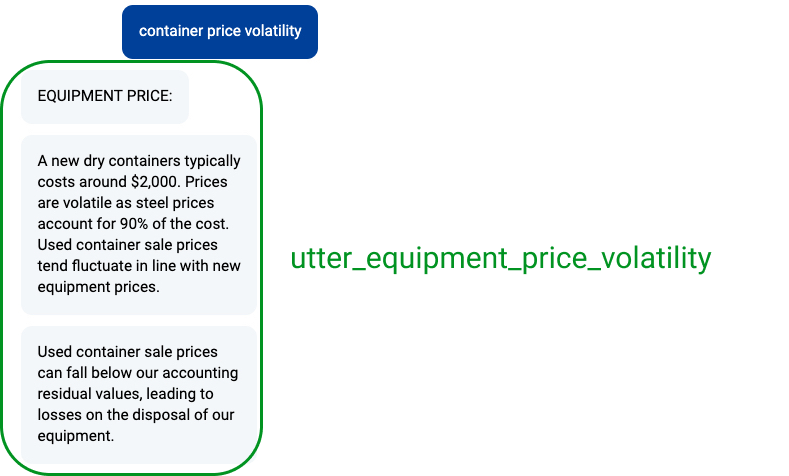
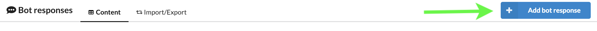
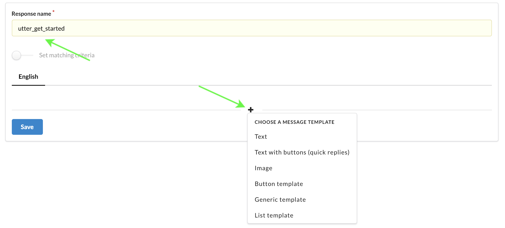
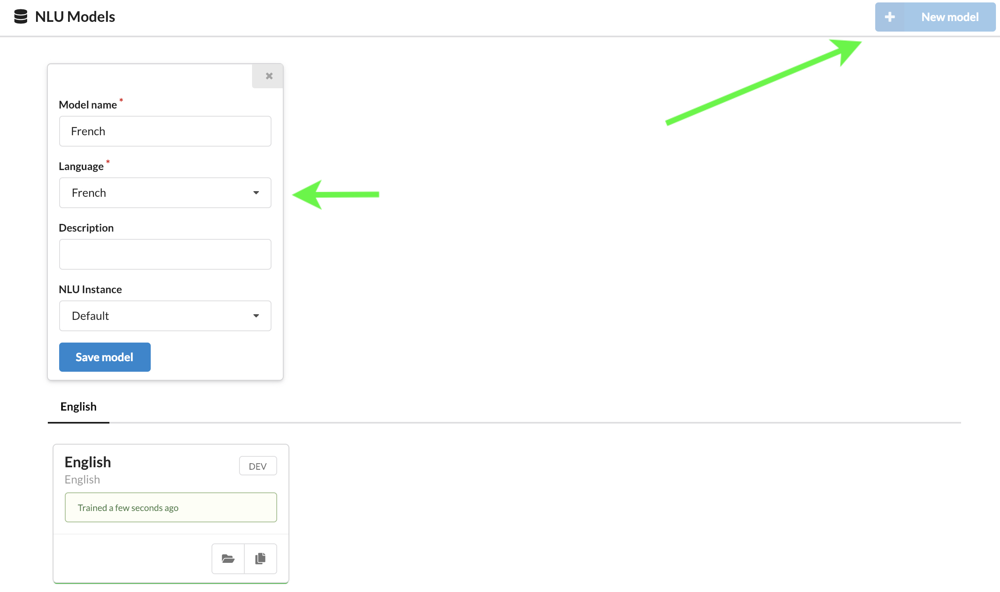
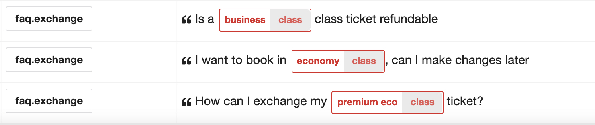
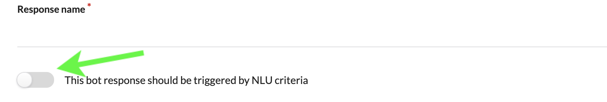
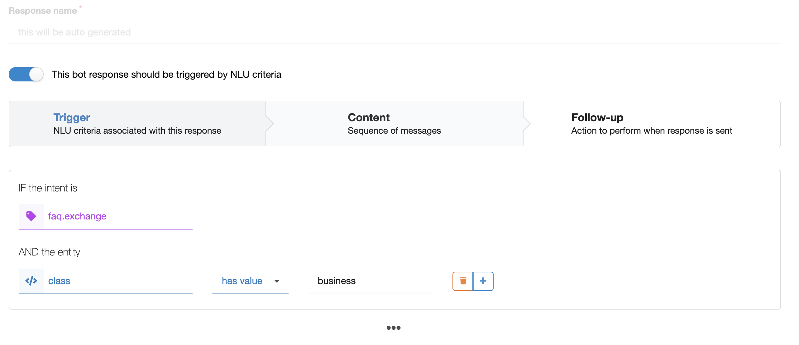
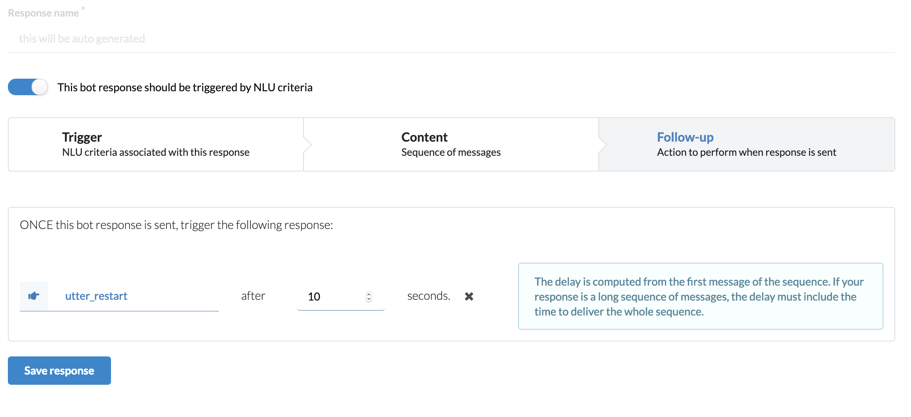

# Bot responses

In Botfront, a bot response is a **sequence** of messages: in the example below, the three messages belong to the same `utter_equipment_price_volatility` sequence. 

If you decide this response should have more or less messages, you can make your changes in Botfront without altering your story and domain, avoiding the need to retrain.




## Create a sequence

1. Use the **Add bot response** button to create a new sequence



2. Choose a unique name for your bot response, then click the <i class="fas fa-plus"></i> icon.
   


::: tip NOTE
The response name must start with `utter_`
:::

Let's choose **Text with buttons (quick replies)**. It fills the message with a template. 


Messages are written in a `YAML` format. The above example will display a text message followed by two quick replies. Replace the _text above the buttons_ with the text message, and _Button title 1/2_ with the labels of your buttons.

### Writing text

Text messages are supported by all platforms and can be formatted as follows:

```yaml
text: "Hello"
```

::: tip TIP: always use quotes
Although the YAML specification does not require quotes ( i.e `text: Hello` works too), we recommend to use them all the time. Without quotes, some sentences with `:` or special characters such as `\n` could fail at validation time or even at runtime
:::

### Markdown support

Some channels, such as the [Webchat](https://github.com/botfront/rasa-webchat) with `bot.socketio.SocketIOInput` have built-in markdown support

```yaml
text: "Hello from [Botfront](https://botfront.io)"
```

### Buttons payloads

Let's deal with the `payload` fields. Rasa Core dialogues are driven by dialogue acts (intents and entities), so button payloads must contain dialog acts. Let's look at an example:

```yaml
text: "What do you wanna do?"
buttons:
  - title: Book a flight from Paris to New York
    payload: /book_flight{"from":"CDG", "to":"NYC"}
  - title: Book a flight from Montreal to Rome
    payload: /book_flight{"from":"YUL", "to":"FCO"}
  - title: Say good bye
    payload: /chitchat.bye
```

The payload syntax is `/intent{"entity1_name":"entity1_value", "entity2_name":"entity2_value"}`.
Entities are optional (as shown in the 3rd button)

## Languages

Botfront is multilingual but as you can see, the only language available in the bot response above is English. To enable more languages you simply need to add an NLU model in the desired languages.

* Let's create a new NLU model in French



* Then let's re-open our bot response. French is available


## Using bot responses

### In Rasa Core stories

You can use bot responses in your Rasa Core stories

```Story
* chitchat.greet
    - utter_greet
```

::: tip NOTE
You can utter the whole sequence of messages of a bot response with a single `utter_...` action.
:::

## Q&A / FAQ bots

Botfront lets you build rich Q&A systems by mapping responses to various combinations of intents and entities without having to re-train your dialogue models.

Suppose you want to answer questions related to flight tickets exchange conditions. It's always the same intent (`faq.exchange`) but the answer may vary according to the `class` entity:



Now let's create a bot response for the business class case. First enable NLU matching criteria:



Then determine the NLU criteria that should trigger your response. 



::: tip Q&A feature requires intents prefixed with <code>chitchat.</code> or <code>faq.</code>
Botfront adds a special behaviour to intents prefixed with `chitchat.` or `faq.` allowing to map a response without having to retrain the whole model. In the above example, `faq.exchange` will be handled by the Q&A feature only because it starts with `faq.`. If the name was `exchange` Rasa would just try to find a corresponding story.
For more information, see [Q&A and FAQ Bots](/guide/bot-responses/#q-a-faq-bots) or [Rules](/guide/users/rules.html)
:::

::: warning
If several responses can be triggered by a NLU criterium, only ONE response will be sent (the first that matches). Be very careful when using the `is detected` clause for entities. Suppose you have a trigger `intent:book, entity:city(is detected)` and another trigger `intent:book, entity:city(has value Paris)`. Any response could be triggered by _I want to book in Paris_
:::

And that's it. Your bot can answer the question, no need for training.

# Under the hood

This behaviour is obtained with the following rule (in every new project by default)

```yaml
intent_substitutions:
  - intent: chitchat\.(.*)
    with: faq
    entities:
      add:
        - name: intent
          value: '{intent}'
  - intent: faq\.(.*)
    with: faq
    entities:
      add:
        - name: intent
          value: '{intent}'
```

This rule will intercept every message with an intent starting with `faq.`, set the intent to `faq` and an entity `name` with the original intent as the value.

Then a custom action `action_faq` will lookup a corresponding response and utter it. This action is available in the `custom_actions` folder in the botfront-project repo.

Since we always have the same intent and entity, only one story is needed:

```md
* faq{"intent":"original_intent}
  - action_faq
```

# Combining Q&A with stories

The Q&A feature lets you easily deal with chitchat and side questions. You just have to insert the faq stories here and there in your training data.

```md
* book_flight
  - utter_ask_class
* faq{"intent":"original_intent}
  - action_faq
  - utter_ask_class
* book_flight{"class":"business:}
...
```

### Follow up

In some case you might want a bot response to trigger another action. You might want to ask feedback (_Did I answer your question?_) or show a menu with common options. You can easily do that with a follow-up. 

**Note that the follow-up is canceled if a user types a message before it is executed.**



::: warning
The delay starts when the first message of the sequence is sent. So if you have a sequence of 5 messages taking 10 seconds to unroll, you should set a delay of at least 10 seconds.
:::


