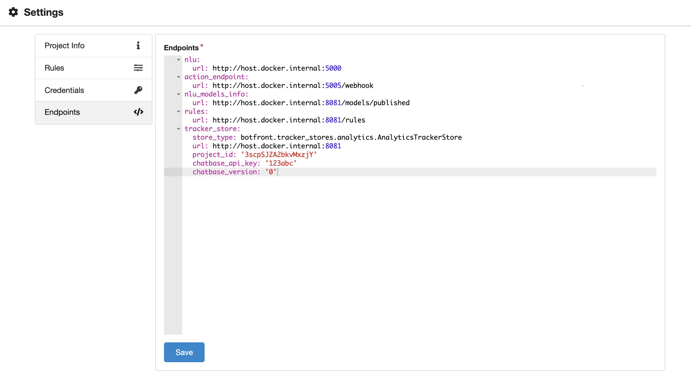

# Endpoints

The endpoints need contains endpoints needed by Rasa Core.


::: tip
If you're using the `docker-compose` version these should be prefilled for you. You'd only have to complete the analytics part if you require it.
:::

Two endpoints have been added to the default Rasa endpoints.

**`rules`**
This endpoint returns the rules in a JSON format. Rules are reloaded every minute. So you don't have to restart Core

**`nlu_models_info`**
This endpoint returns an object containing the _online_ model for each language as well as the default project language. See the [Publishing models section for more details.](../nlu/instances-models.html#publishing-models)

### Analytics tracker store
Botfront comes with a custom tracker store called `AnalyticsTrackerStore`, which serves as a regular tracker store and provides a Chatbase integration. All you need to do is provide your chatbase API key.


::: warning
The following section is particularly important if you use the `EmbeddingsPolicy`. 
:::


One issue we have observed with native TrackerStore implementations is a degradation in performance when the conversations gets very long. Long conversations can't be avoided on channels such as Messenger where the conversation with a user never resets. As a result, an ever longer payload gets carried around between the Core, the actions server and the database. 

In most situations, only the few latest turns of the convo are needed to accurately predict the next action, so this implementation provides a mechanism to keep a limited amount of events in memory, while of course persisting everything in the database. 

`max_events` lets you decide how many events you want to keep in memory for prediction. It defaults to `100`, you might want to increase that value with the `EmbeddingsPolicy`. Set it to `0` if you want to keep it all in memory. 

Another issue is that memory requirements grow with the number of conversations even when many sessions are inactive. To prevent that, a sweeper runs every 30 seconds to clear inactive sessions from memory. All the sessions with the latest event occuring more than `tracker_persist_time` seconds earlier will be swept. `tracker_persist_time` defaults to `3600`, so every conversation inactive for more than an hour will be removed from memory. If the user comes back after an hour, the latest `max_events` will be fetched from the database so this mechanism is completely transparent to the user.


```yaml
tracker_store:
  store_type: botfront.tracker_stores.analytics.AnalyticsTrackerStore
  url: http://botfront-api:8080
  project_id: < Botfront project ID >
  chatbase_api_key: < Chatbase API key >
  chatbase_version: < Chatbase version >
  max_events: < Maximum number of events kept in memory >
  tracker_persist_time: < Delay of inactivity before the conversation gets removed from memory >
```


