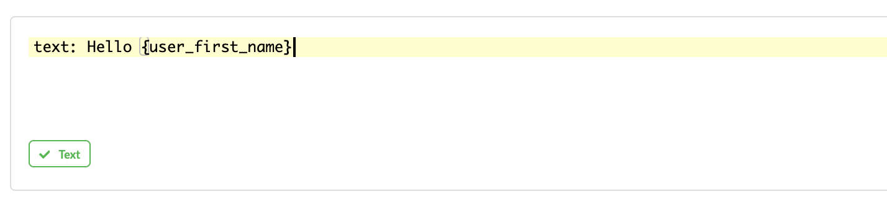

---
meta:
  - name: description
    content: 'Botfront: expose your Rasa assistant with the Rasa Webchat'
  - name: keywords
    content: botfront stories nlu rasa slots deployment
permalink: /deployment/:slug
---

# Expose your assistant

Now that Botfront is installed you can expose your chatbot to end users. This guide will show you how to install a chat widget on your website and to connect it to Botfront.

## Frontend: configure the widget

Install the [Rasa Webchat](https://github.com/mrbot-ai/rasa-webchat) on your website. You will find installation instructions by following the link.
It is very important to set the language you want to use, even if you only have one:

```javascript
<div id="webchat"/>
<script src="https://storage.googleapis.com/mrbot-cdn/webchat-0.X.X.js"></script>
<script>
  WebChat.default.init({
    selector: "#webchat",
    initPayload: "/get_started",
    ...
    customData: { language: 'en' }, // can be any language code
    ...
  })
</script>
```

### Multilingual sites

If your website supports several languages, you can translate your bot in Botfront and initialize the widget with the current selected language.

### Page specific intro message

You can also specify different intros/welcome messages depending on the page the conversation starts at. For example, if a user opens the bot on a pricing page, you can set a different intro than the homepage in the `initPayload`:

```javascript
WebChat.default.init({
  ...
  initPayload: '/get_started_home',
  ...
})
```

```javascript
WebChat.default.init({
  ...
  initPayload: '/get_started_pricing',
  ...
})
```

All you have to do is create 2 different stories, one starting with `* get_started_home` and another one with `* get_started_pricing`. You can use the [Intro Stories](/) feature to group these stories and easily test them in Botfront

# Backend: configure the channel

The **settings > credentials** screen lets you configure the channels that you want to support.

::: warning
Botfront has specific features that are not natively supported by Rasa Core. It is multilingual, and bot responses support sequences of messages. For this reasons, native Rasa Core channels may not work. Botfront currently provides 1 channel to be used with the [Rasa Webchat](https://github.com/mrbot-ai/rasa-webchat) and Facebook Messenger is on the way.
:::

## Webchat channel

There isn't much to configure here, you can just set the `session_persistent` param to `false` if you prefer to create a new session each time the user reloads the page containing the widget.

```yaml
rasa_addons.core.channels.webchat.WebchatInput:
  session_persistence: true
  base_url: https://your.rasa.host:5005 # set this to the Rasa service host
  socket_path: '/socket.io/'
```

### rasa_addons.core.channels.rest.RestInput

#### Example usage

```yaml
credentials:
...
rasa_addons.core.channels.webchat.WebchatInput:
  session_persistence: true
  base_url: {{rasa_url}}
  socket_path: '/socket.io/'
...
```

<!-- ## Facebook

::: warning
The Facebook channel will be ready very soon
:::

<!-- 
This channel inherits from the [Rasa Core Facebook channel](https://rasa.com/docs/core/connectors/#facebook-setup). Besides supporting multilingual and sequence of messages features, it provides a better support for Messenger specific templates features.

```yaml
bot.facebook.MultiFacebookInput:
  verify: <verify phrase>
  secret: <facebook app secret>
  page-access-token: <facebook page token>
  fields:
  - first_name
  - last_name
  - ...
```

Only the `fields` field is specific to Botfront. You can retrieve user profile information in bot responses using the following template format: `{user_<field>}`. For example:



You need special permissions to access profile info (except first and last name). The `fields` fields let you specify the fields the channel is allowed to query from the Facebook Profile API.


::: warning IMPORTANT
You must restart Rasa Core for your changes to take effect. If you are running Botfront with **docker-compose** you can run `docker-compose restart core`
::: -->

## Endpoints

Endpoints let you define how your Rasa instance communicates with`:
- the Botfront API to query the bot responses (`nlg`)
- the actions server (`action_endpoint`)
- the tracker store (`tracker_store`)

```yaml
nlg:
  url: 'https://<botfront-api-host>/project/bf/nlg'
action_endpoint:
  url: 'https://<actions-server-host>/webhook'
tracker_store:
  store_type: rasa_addons.core.tracker_stores.AnalyticsTrackerStore
  url: 'https://<botfront-api-host>'
  project_id: 'bf'
```

### Analytics tracker store configuration

Botfront comes with a custom tracker store called `AnalyticsTrackerStore`, which serves as a regular tracker store and provides a Chatbase integration. All you need to do is provide your chatbase API key.

::: warning
The following section is particularly important if you use the `EmbeddingsPolicy`.
:::

One issue we have observed with native TrackerStore implementations is a degradation in performance when the conversations gets very long. Long conversations can't be avoided on channels such as Messenger where the conversation with a user never resets. As a result, an ever longer payload gets carried around between the Rasa, the actions server and the database.

In most situations, only the few latest turns of the conversation are needed to accurately predict the next action, so this implementation provides a mechanism to keep a limited amount of events in memory, while of course persisting everything in the database.

`max_events` lets you decide how many events you want to keep in memory for prediction. It defaults to `100`, you might want to increase that value with the `EmbeddingsPolicy`. Set it to `0` if you want to keep it all in memory.

Another issue is that memory requirements grow with the number of conversations even when many sessions are inactive. To prevent that, a sweeper runs every 30 seconds to clear inactive sessions from memory. All the sessions with the latest event occuring more than `tracker_persist_time` seconds earlier will be swept. `tracker_persist_time` defaults to `3600`, so every conversation inactive for more than an hour will be removed from memory. If the user comes back after an hour, the latest `max_events` will be fetched from the database so this mechanism is completely transparent to the user.

#### Chatbase integration

If you want to use Chatbase with your assistant, all you have to do is set the `chatbase_api_key`.

```yaml
tracker_store:
  store_type: botfront.tracker_stores.analytics.AnalyticsTrackerStore
  url: http://botfront-api:8080
  project_id: < Botfront project ID >
  chatbase_api_key: < Chatbase API key >
  chatbase_version: < Chatbase version >
  max_events: < Maximum number of events kept in memory >
  tracker_persist_time: < Delay of inactivity before the conversation gets removed from memory >
```
