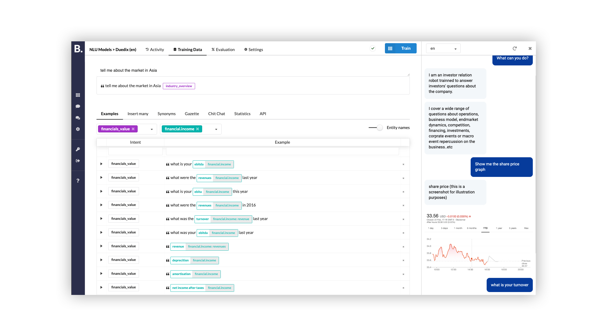

# Quick Start

## What is it?

Botfront is an open source platform to build chatbots with Rasa. With Botfront you can:
- Build, train and evaluate NLU models
- Edit and store bot responses
- Do simple Q&A (no code) and mix them with more complex stories (in code)
- Monitor conversations
- Review and annotate incoming NLU utterances
- Build multilingual chatbots

 

This tutorial will guide you through the installation and the development of your first chatbot with Botfront/Rasa. You will run Botfront with `docker-compose` which makes running all the applications needed for your project (Botfront, Rasa, Mongo) very easy.

## Setup

### Install Docker

- [Install Docker for Mac](https://hub.docker.com/editions/community/docker-ce-desktop-mac)
- [Install Docker for Windows](https://hub.docker.com/editions/community/docker-ce-desktop-windows) 

If you already have Docker installed, make sure it's up to date.

::: warning Linux users
`host.docker.internal` does not resolve on Docker for linux, see [this issue](https://github.com/docker/for-linux/issues/264) for possible solutions.
:::

### Install Botfront

Open your terminal 
::: tip Beginner tip
On a Mac, press `Cmd+Space`, look up **_terminal_** and select **_Terminal.app_**
:::

Copy the following lines, paste them in your terminal window and type `Enter`.

```bash
git clone https://github.com/botfront/botfront-starter
cd botfront-starter
docker-compose up
```

First, it's going to download all the Docker images required (it's going to take a while, be patient). Then it's going to start all the services. 
::: tip Note
You can safely ignore the errors in the logs: we just need to setup Botfront and it's all going to be fixed. 
:::

### Start Botfront

Open [http://localhost:8888](http://localhost:8888) and follow the steps to create your first project. (If it doesn't work just wait a few more seconds for the service to be ready)

::: tip If you're following the tutorial
Name your project "My First Project" and choose the English language if you want to follow the rest of this tutorial
:::

<video autoplay muted loop width="740" controls>
  <source src="../../videos/setup.mp4" type="video/mp4">
  Your browser does not support the video tag.
</video> 

Congratulations, Botfront is installed. You should see a screen with your _First NLU Model_.

## Add training data

Let's just teach our NLU model to recognize simple things like "Hi", "Thanks", "Bye". We'll do more advanced stuff later.
Botfront comes with pre-trained intents for general conversation (Chit Chat). The following video shows how to:
1. Import Chit Chat intents to your model
2. train and test your model

<video autoplay muted loop width="740" controls>
  <source src="../../videos/nlu_quickstart.mp4" type="video/mp4">
  Your browser does not support the video tag.
</video> 


## Create a Bot response

Now that our bot can understand a few things, let's see how we can get it to respond. The following video shows how to apply create a bot response and to assign it to an intent.

::: tip Botfront adds a special behaviour to intents prefixed with <code>chitchat.</code> or <code>faq.</code>
This allows to map a response without having to retrain Rasa on stories. We are using this feature here. \
For more information, see [Q&A and FAQ Bots](/guide/bot-responses/#q-a-faq-bots) or [Rules](/guide/users/rules.html)
:::

<video autoplay muted loop width="740" controls>
  <source src="../../videos/bot_responses_quickstart.mp4" type="video/mp4">
  Your browser does not support the video tag.
</video> 

This example is minimal, but you can do more advanced assignments such as combinations of intent and entities.


## Monitor and improve

You can follow the conversations from the `conversations` menu item, and monitor NLU from the `Activity` tab in your NLU model.

## What's next
You learned:

1. How to setup Botfront on your machine
2. How to add data and train your first NLU mode,
3. How to create a simple Q&A bot without coding.

There's a lot you can do with this already, but there's way more. You could read the NLU guide and build a more advanced NLU model