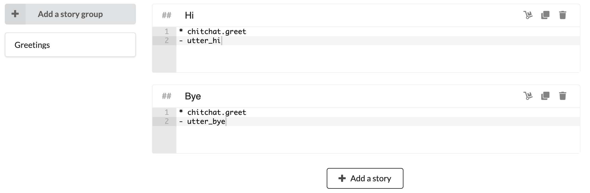

---
meta:
  - name: description
    content: 'Botfront tutorial: setup Botfront and start building your Rasa chatbot'
  - name: keywords
    content: botfront stories nlu rasa
permalink: /getting-started/:slug
---

# Quick Start

In this guide you will learn:

- How to write and train a **story** 📖
- How to create and train a simple **NLU** model 🤓
- How to add a bot response

## Train and try your stories

Select **stories** in the sidebar, create a new group called **Greetings**, paste the content of 2 stories above (starting with `chitchat.greet` and `chitchat.bye`) in two dictinct stories, and **train**.

Then open the chat window. Since we haven't trained our bot to understand natural language, we'll talk with intents. It can be done by prepending a `/` to the intent name. So you can start the conversation with `/chitchat.greet`. You should be able to reproduce the conversation above: if you say `/chitchat.greet` three times, you should get 3 different answers.

## Add natural language

Select NLU from the sidebar and go the **Chitchat** tab. Select `chitchat.greet` and `chitchat.bye`, import, and train.

## Add a bot response

Select **Bot responses** in the sidebar, then create four different bot responses. The names of the bot responses will be used in stories:
- `utter_hi_there`
- `utter_hi_again`
- `utter_hmm_really`
- `utter_bye`

Congrats, now you can finally have a real (!) conversation with our bot!

## Adding languages

You can easily add a new language to your project in the project settings. Once you save, your new language will be available in the top left selector.

Let's add **French** in the settings and add our training data as well, and retrain (since we added French we have ready to use data here as well).

And voilà, our bot speaks French!

## Next steps

You can dive in the official Rasa [docs](https://rasa.com/docs) or simply follow the rest of the tutorial.

