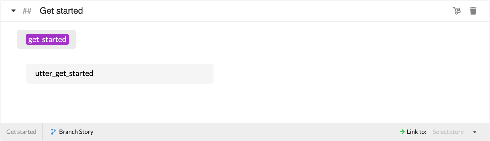
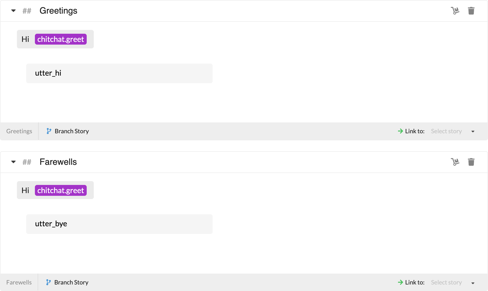
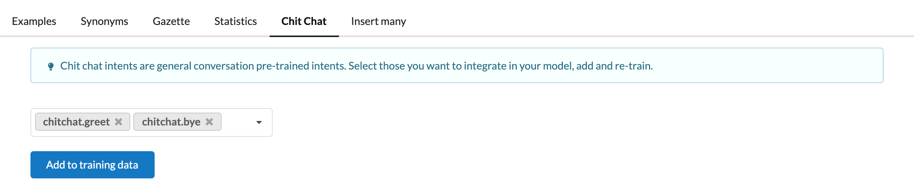
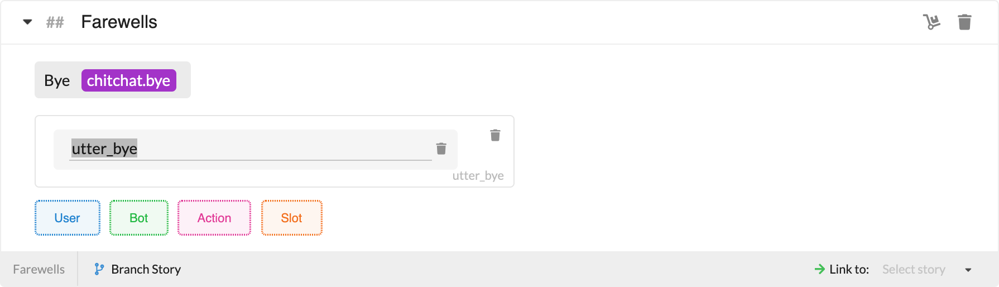
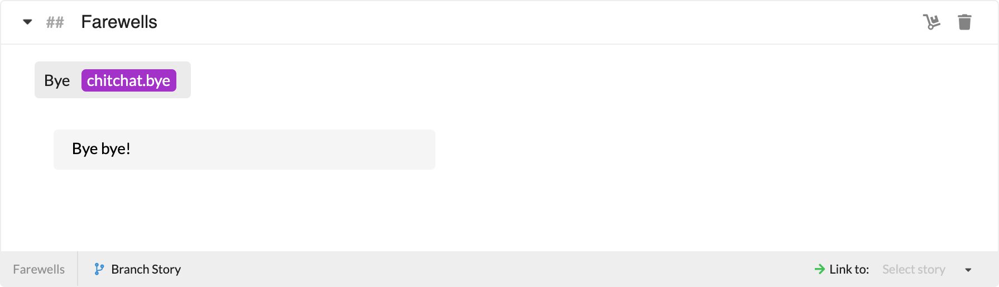

# Quick Start

In this guide you will learn:

- How you can train **stories** 📖
- How you can create and train a simple **NLU** model 🤓
- How you can seamlessly create/edit stories with real content using the conversation builder 💬
- How you can add and handle a second language 🌍

## Train and try your stories

When a project is created, two story groups with 3 stories in total are created. Select **Stories** in the sidebar to observe them.

**Intro stories**

**Default stories**

All stories will open in **Botfront Markdown** by default. When you switch to the visual conversation builder, you will see that bot responses will be automatically created with their names (IDs) as their content, and the yellow warnings will disappear. You may edit the response content on the conversation builder if you wish.

Click **Train everything** on the top right and then open the chat window. Since we haven't trained our bot to understand natural language yet, we'll talk with intents. It can be done by prepending a `/` to the intent name. So you can start the conversation with `/chitchat.greet`. You should be able to reproduce the conversations above: if you say `/chitchat.greet` three times, you should get 3 different answers.

## Add natural language

Select NLU from the sidebar and go the **Chitchat** tab. Select `chitchat.greet` and `chitchat.bye`, import, and train everything.

## Add bot response content

The easy way to do this is in the conversation builder. You can simply edit existing response content by clicking on them, or add new bot responses using the green **Bot** button.

You can also navigate to the **Responses** section from the sidebar, and create/edit your bot responses. Congrats, now you can finally have real (!) conversations with your bot!

## Adding languages

You can easily add a new language to your project in the **Project Info** section in the project settings. Once you save, your new language will be available in the top left selector on applicable pages.

Let's add **French** in the settings and add our training data as well, and retrain (since we added French we have ready to use data for it too).

If we don't add content for bot responses in French, it would display them with their names (IDs) as \_utter\_\_ in the chat. What we can do here is either add response content for French as well in the Responses section, or we can switch the default language of the project to French to edit the response content in the conversation builder. You can always switch the default language back to your desired language after editing your response content in the conversation builder.

And voilà, your bot speaks French!

<Important type="tip">

You can use the language selector on the top of the chat widget to chat with your bot in the language you want.

</Important>

## Next steps

Simply follow the rest of this guide and dive even deeper into the world of NLU and conversation building with Botfront!
