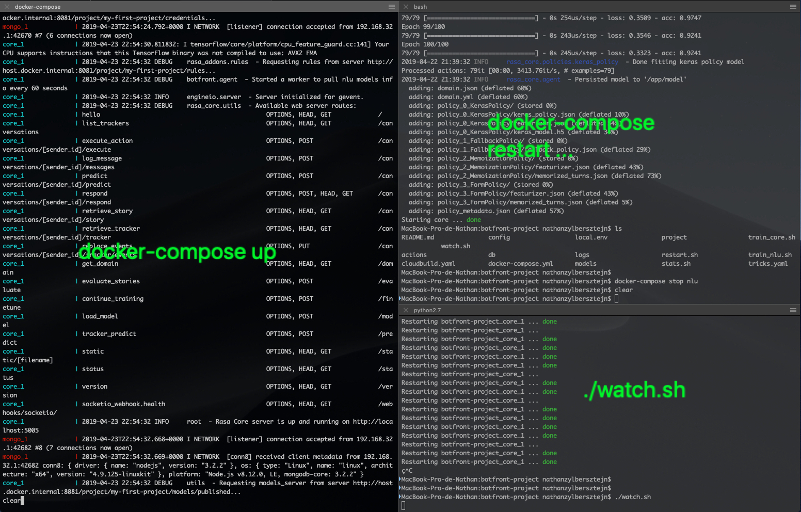

# Advanced Rasa usage

Botfront has a deep Rasa Core integration, however not everything happens in Botfront.
This tutorial is primarily for developers.

You will learn:
- How to write and train stories
- How to write custom actions
- How to assign Duckling entities to roles in the sentence 

## Prepare your environment
You should have a terminal window open showing `docker-compose` logs. Open another window or tab (`Cmd+T`) and run `./watch.sh` from the project root. This will restart containers when you train Rasa Core or save your actions

If you are an [iTerm2](https://www.iterm2.com/) user you could setup your wokspace like that:
- One window with the `docker-compose up` logs
- One window to execute various commands (`docker-compose restart ...`)
- One window to run the `watch.sh`script that rebuilds the action server on every change



## Stories

Our end goal is a conversation like this:

```
- User: We want to book a room for 2 adults and 2 kids
- Bot: You are 2 kids and 2 adults, four in total and that is an even number
```

But let's start with a simple version:
```
- User: We want to book a room for 2 adults and 2 kids
- Bot: Ok
```

### 1. Add a story

Open `stories/stories.md` in your favorite editor. It already contain a story. Add the second one.

```{5,6,7}
## faq
* faq OR faq{"intent":"any"}
  - action_faq
    
## Inform guests 
* inform_guests
  - utter_ok
```

### 2. Update the domain
Open `domains/domain.yml` and add `inform_guests` to the **intents** section and `utter_guests` to the **actions** section.

```yaml{3,9}
intents:
  - faq
  - inform_guests # Declare the intent

...

actions:
  - action_faq
  - utter_ok# Declare the action
```

### 3. Train Core on your story
Open a third tab in your terminal and run `./train_core.sh`.
When Core has restarted after the training, verify that the story works by typing `/inform_guests` in the [chat window](http://localhost:8080). 

::: tip
Note that we prefixed the intent with `/`. Since there is no training data for that intent, we can't use natural language yet. The `/` allows us to invoke the intent directly.
:::

The bot should reply with `utter_ok`.

<video autoplay muted loop width="740" controls>
  <source src="../../videos/core_simple_story.mp4" type="video/mp4">
  Your browser does not support the video tag.
</video> 

In the next sections we'll make the interaction more natural.

### 4. Add training data to `inform_guests`

Add the following examples to the `inform_guests` intent of your NLU model:

```
We need a room for 2 adults and 2 children
A room tonight for 2 adults and 3 kids
A room for 2 adults
```

And train it.

::: tip
Make sure to add at least 2 intents if you are missing one, you can go on the Chit Chat tab and select any intent along with the already selected `inform_guest`.
:::

<video autoplay muted loop width="740" controls>
  <source src="../../videos/nlu_insert_many.mp4" type="video/mp4">
  Your browser does not support the video tag.
</video> 

### 5. Add a bot response

The last thing to associate a bot response to the `utter_ok` we put in the story.

<video autoplay muted loop width="740" controls>
  <source src="../../videos/core_bot_response.mp4" type="video/mp4">
  Your browser does not support the video tag.
</video> 

::: tip
You just created a sequence of messages. The bot will utter 2 messages even if your story only had one action following `* inform_guests`
:::

### 6. Chat with your bot

Finally, let's chat with our bot and see the final result.

<video autoplay muted loop width="740" controls>
  <source src="../../videos/core_chat_with_response.mp4" type="video/mp4">
  Your browser does not support the video tag.
</video> 

## Custom Actions

Let's just remind ourselves our end goal:

```
- User: We want to book a room for 2 adults and 2 kids
- Bot: You are 2 kids and 2 adults, 4 in total and that is an even number
```

Here, we're going to add another intermediate step:
```
- User: We want to book a room for 2 adults and 2 kids
- Bot: You are 4 in total and that is an even number
```

We need the following changes:
1. Add Duckling to our NLU pipeline to extract the numbers
2. Create a custom action to sum all the numbers found in the utterance and tell if it's an odd or even number.

### 1. Add Duckling to the NLU pipeline

```
- name: "components.botfront.duckling_http_extractor.DucklingHTTPExtractor"
  url: "http://host.docker.internal:8000"
  dimensions:
  - "number"
```

::: tip NOTE
`components.botfront.duckling_http_extractor.DucklingHTTPExtractor` provides the same functionality as `ner_http_duckling` and adds the possiblity to append the user `timezone` and `reftime` to the query string for better personalization of the user experience. More in the **Training Data > API** tab.
:::

<video autoplay muted loop width="740" controls>
  <source src="../../videos/add_duckling.mp4" type="video/mp4">
  Your browser does not support the video tag.
</video> 

### 2. Create a custom action

Open the `actions/custom_actions/` and add a new file called `my_actions.py` and paste the following content:

```python
import logging
from functools import reduce
from rasa_core_sdk import Action
from rasa_core_sdk.events import SlotSet, ReminderScheduled

logging.basicConfig(level="DEBUG")
logger = logging.getLogger()

class GuestsAction(Action):

    def name(self):
        return 'guests_action'

    def run(self, dispatcher, tracker, domain):
        entities = tracker.latest_message.get('entities', [])
        
        # Only keep 'number' entities
        numbers = list(filter(lambda e: e.get('entity') == 'number', entities))

        # Stop here if no numbers found
        if not len(numbers):
            dispatcher.utter_message("How many are you?")
            return []
        
        # Compute the sum of all 'number' entity values
        number_of_guests = reduce(lambda x, y: x + y, map(lambda e:e.get('value'), numbers))

        is_even = number_of_guests % 2 == 0 

        message = 'You are {number_of_guests} in total and that is an {is_even} number'.format(
            number_of_guests=number_of_guests, 
            is_even='even' if is_even else 'odd')
        
        dispatcher.utter_message(message)
        return []
```

Now add the following in stories.md, make sure to remove `utter_ok` and add `guests_action`

```{7}
## faq
* faq OR faq{"intent":"any"}
  - action_faq
    
## Inform guests 
* inform_guests
  - guests_action

```

and modify the following in domain.yml, again make sure to remove `utter_ok` and add `guests_action`

```yaml{9}
intents:
  - faq
  - inform_guests 

...

actions:
  - action_faq
  - guests_action
```

The `actions` service should be rebuilding (in your terminal) and you should see this:

```
INFO:rasa_core_sdk.executor:Registered function for 'action_faq'.
INFO:rasa_core_sdk.executor:Registered function for 'guests_action'.
```

Then you can talk with your bot:

<video autoplay muted loop width="740" controls>
  <source src="../../videos/dev_custom_action_bot.mp4" type="video/mp4">
  Your browser does not support the video tag.
</video> 

### 3. Associate Duckling entities with trainable entities

Duckling is great to extract [stuctured entities of all sorts](https://github.com/facebook/duckling#supported-dimensions). However if you have several entities of the same type you cannot associate them to a position in the sentence.

And that's exactly what we want to do: we want to distinguish the number of adults from the number of children. Here is how we're going to proceed:

#### Annotate our example with new entities

#### Add a special component to our pipeline

Add this component to the pipeline **after** the `ner_crf` and the `components.botfront.duckling_http_extractor.DucklingHTTPExtractor`.

```yaml
- name: components.botfront.duckling_crf_merger.DucklingCrfMerger
  entities:
    kids_count: ["number"] 
    adults_count: ["number"]
```

<video autoplay muted loop width="740" controls>
  <source src="../../videos/add_crf_merger.mp4" type="video/mp4">
  Your browser does not support the video tag.
</video> 


