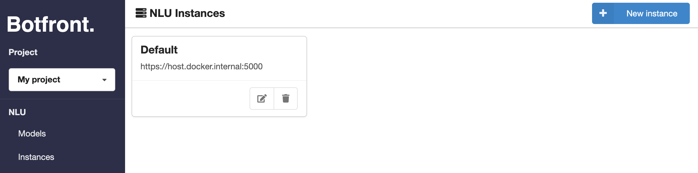
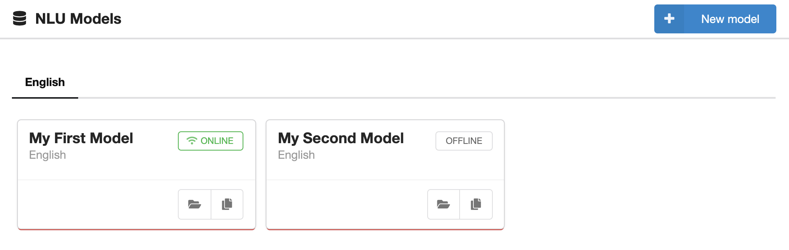

# Instances and models

## Assigning instances to models

Instances are the Rasa NLU Endpoints used by NLU models.

To use this instance in your model, you must select it in your model's general settings.

## Publishing models

Because you can have several models per language in a project, you must specify which model must be used by Rasa Core for every supported language. That's the purpose of the `ONLINE`/`OFFLINE` button.

When you set a model `ONLINE`, Core will (after a few seconds) redirects NLU requests to that model. 

