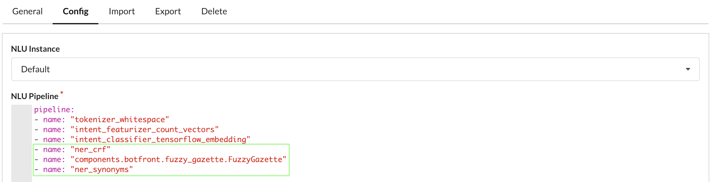

# Training intents and entities

**Intents** capture the general meaning of an utterance while **entities** refers to some particular elements *within* a sentence. Let's say you create a flight booking bot.

> I want to book a flight from **Paris** to **Montreal**

The intent of the example above is to book a flight from Paris to Montreal. So let's call it `book_flight`. Entities are Paris and Montreal. So let's call them `from` and `to`.

Then we'll need more examples:

> Is there a flight from **Rome** to **London** tomorrow?\
> I wanna fly from **The big apple** to **the city of light**

And in Botfront it's gonna look like this:


After you train you can verify it works as expected by typing a sentence in the _User says..._. You can see that the `from` and `to` entities are picked up as expected.

::: tip NOTE
You don't see an intent here because our dataset only has one intent. You need at least two intents to train an intent classifier.
:::


## Entity Synonyms

However in the example above, if we really want to pass it to a booking engine or a price comparator, we may need airport codes. Entity synonyms can be used for that. In the example below, we mapped _the city of light_ to CDG and _the big apple_ to JFK in the synonyms, retrained, and the values returned for the entities were **CDG** and **JFK**.


::: tip
Adding synonyms in the table is generally not enough. You still need to teach the entity extractor the various form an origin or a destination could take by adding more examples to the training data
:::

We must still assume that our users are careful enough to avoid typos and spelling mistakes. Synonyms won't help model figure out that the _the big aple_ is **JFK** or that the _citi of lite_ is _CDG_. 

However, a fuzzy gazette can.

## Fuzzy Gazettes

Fuzzy gazettes are useful when you expect the values of an entity to be in a finite set, and when you want to give users some spelling latitude. Common examples are colors, brands, or cities. 
The example below shows how to set up a gazette to help the model understand that _the big aple_ is **JFK** and that the _citi of lite_ is _CDG_:


All you have to do is specify the list of allowed (or commonly) expected values (there aren't that many ways of saying Paris or New-York). Th_spelling latiture_ is adjusted with fuzziness parameter. 100 will have no telerance to errors, 0 will be extremely tolerant. It will always return one of the values even if the user types something completely out of scope.

::: tip NOTE
When the entity extractor picks up _citi of lite_, it compares it with every element of the Gazette list and computes a fuzziness score for each element. The highest score is for _the city of light_, which is then mapped to _CDG_ by the synonyms processor. If the highest score is below the minimum score, it means the value is out of scope and the entity is removed.
:::

## _Sorta_ composite entities

Duckling offers an easy way to extract structured entities such as numbers, amounts of money, emails, dates, ... But consider the following sentence:

> I want *2* beers and *3* cokes

If you need to know the count for both beers and cokes, the `number` entities returned by Duckling won't be enough. Luckily we have a component for that.

Annotate *2* as a `beers_count` entity and *3* as a `cokes_count` entity.

Then in the pipeline:

```yaml
- name: ner_crf
  ...
- name: components.botfront.duckling_http_extractor.DucklingHTTPExtractor
  url: http://duckling
  dimensions:
  - "number"
  
- name: components.botfront.duckling_crf_merger.DucklingCrfMerger
  entities:
    beers_count: ["number"]
    cokes_count: ["number"]
```

::: tip The order is important
- The entities are first extracted by the `ner_crf` component. 
- Duckling extracts numbers
- `DucklingCrfMerger` merges them. The value of `beers_count` will be 2
:::

## Configuring the pipeline

For the above to work we need to make sure things happen in the right order:

1. The `ner_crf` component extracts _citi of lite_ from the utterance
2. The `FuzzyGazette` component replaces _citi of lite_ with _the city of light_
3. The `ner_synonyms` componenent maps _the city of light_ to _CDG_.

This is how such a pipeline could look like:



## Semantic variety

Introducing variety is key to build a capable model.

::: tip GOOD
I want to book a flight from **Paris** to **Montreal**\
Is there a flight from **Rome** to **London** tomorrow?\
I wanna fly from **The big apple** to **the city of light**
:::

The following will only get you so far.

::: danger BAD
I want to book a flight from **Paris** to **Montreal**\
I want to book a flight from **Rome** to **London** tomorrow?\
I want to book a flight from **The big apple** to **the city of light**
:::

## Spelling errors

Spelling errors can affect both entity extraction and intent classification. We have seen above how gazettes can help with typos in entities but we were also lucky that it worked so well with only a few examples.
::: tip
**Your data set must reflect how users talk to your bot.**\
If your users do spelling mistakes, then your training data should have some too.
:::
