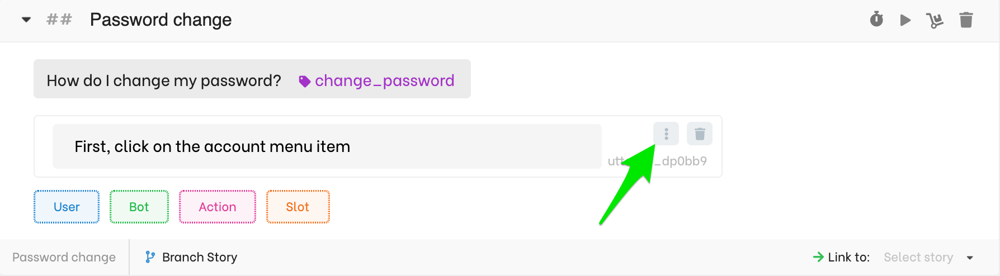
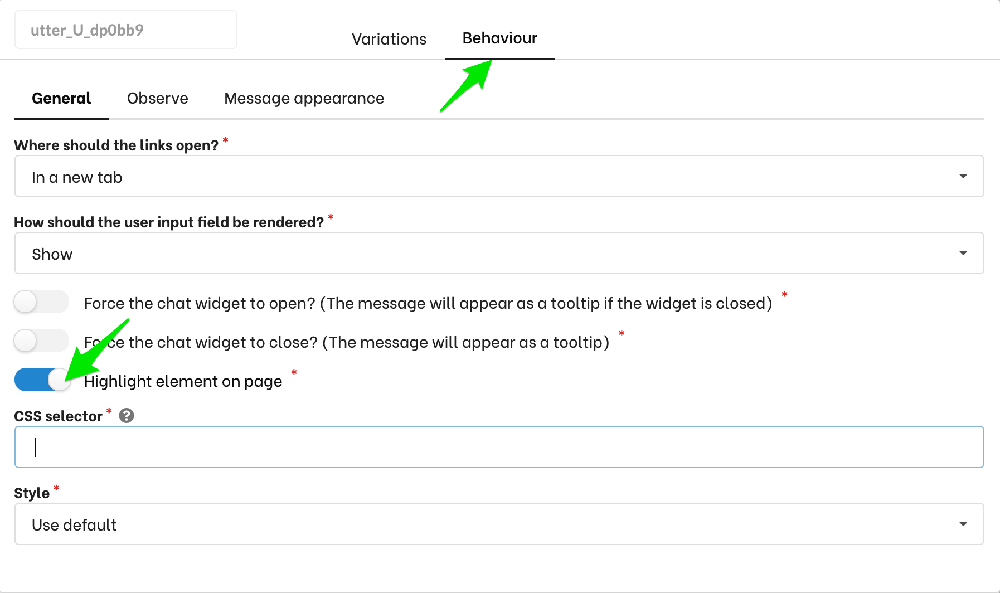
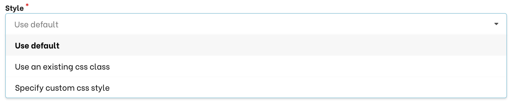
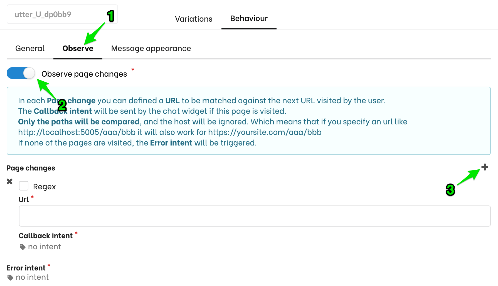
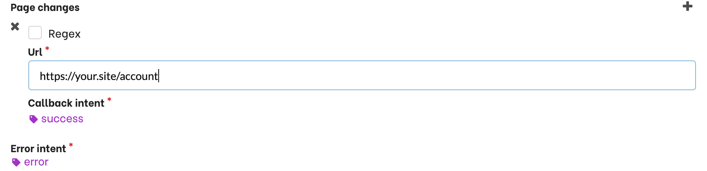
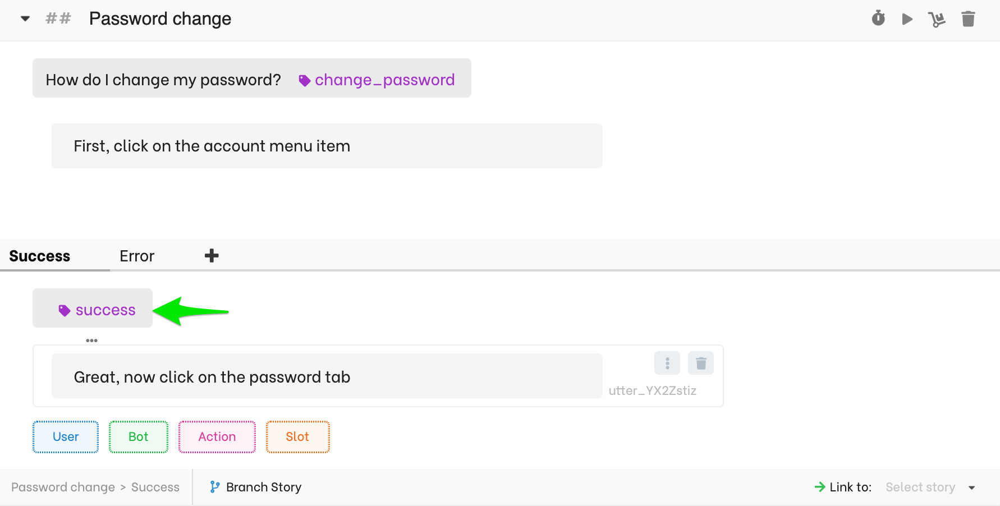
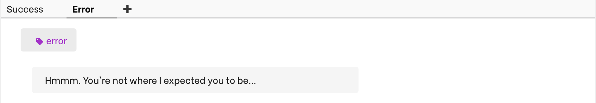
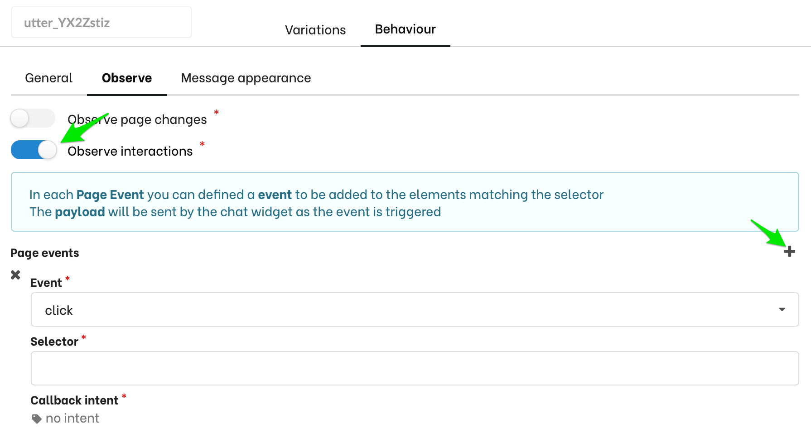

import { FaEllipsisV } from "react-icons/fa";

Available in: <Premium plan="Cloud Pro" /> <Premium plan="Cloud Premium" /> <Premium plan="Enterprise Edition" />

# Guiding users on your website

Very often users ask chatbots how to accomplish a particular task on a website or a web application. For example _How do I change my password_.
Generally, the answer is in the form of a knowledge base article or a list of bullet points.

With Botfront you can bring your support to the next level. Your bot can show users what to do, where to click, where to type information.
Your bot can also observe the user behavior and wait until they complete a step before giving the next instruction.

All this, without having to change your website, all happens in Botfront. Here is how it works.

> **Note**: this requires the use of the chat widget.

## Showing a user where to go
Suppose you're helping users to find out how to change a password.
In your story, give your first instruction in a response then click the <FaEllipsisV size="11"/> to open the response options.

Then select the **Behaviour** tab and enable **Highligh element on page**.
Just paste the CSS selector of the DOM element you want to highlight on the page. Leave the style to default for now.

Now, train and talk to your bot on your website. You should see a blinking green rectangle around the element your want to highlight.

#### Customizing the style of the highlight

By default, Botfront will surround the DOM element you specify with a blinking green rectangle. You can change that is different ways:

- You can write CSS directly in Botfront
- You can specify the name of an existing CSS class on your site.

## Observe user and give more instructions

Now, you want to observe the user and wait until they click on the highlighted element before giving the next instruction. When possible, you also want to give a different message if they clicked on the wrong item.

### Observe a page change

When the user lands on a new page (e.g.`https://your.site/account`) you can observe page changes.

1. Select the **Observe** tab.
2. Enable **Observe page changes**.
3. Add a page change listener.

- Specify the **URL** where you expect the user to lands if they followed your first intruction (e.g.`https://your.site/account`). You can use a regular expression if the URL contains a dynamic parameter.
- Specify the intent that should be triggered if the user completes this step succesfully.
- (optional) Specify the error intent that should be triggered if the user lands on a different page.

Then you can simply branch your conversation using those intents.
When the user clicks on **Account**, the chat widget will send a message containing the **success** intent to the bot who will respond with the next instruction.

And you can handle the error in a different branch.

Now, let's suppose that the next instruction, _Click on the password tab_ does not involve a page change: the user stays on the exact same page, only the state changes (the content of the **Password** tab is displayed).

### Observe page events

In that case, the user will stay in the current page when they follow the instruction your bot provides.
Instead of listening to a page change, you will listen to a `click` on the CSS selector for the tab.

- Select the event you want to listen to (here it's `click`)
- Specify the CSS selector of the DOM element you want to observe (the CSS selector of the **Password** tab)
- Specify the intent to trigger when the user clicks on the tab.

Note that it's not currently possible to trigger an error intent if the user clicks somewhere else.

#### Other applications.

You can use a variety of events. A common use case is to react to a user entering (`focus`) or leaving (`blur`) a form input.

