Available in: <Premium plan="Cloud Pro" /> <Premium plan="Cloud Premium" /> <Premium plan="Enterprise Edition" />

# Proactive conversations

Answering to users is great, but sometimes you can bring even more value by engaging with a user or visitor based on their behaviour on your website.

In Botfront you can do this by associating **triggers** to a story. You can open the triggers menu with the stopwatch in the story header menu.

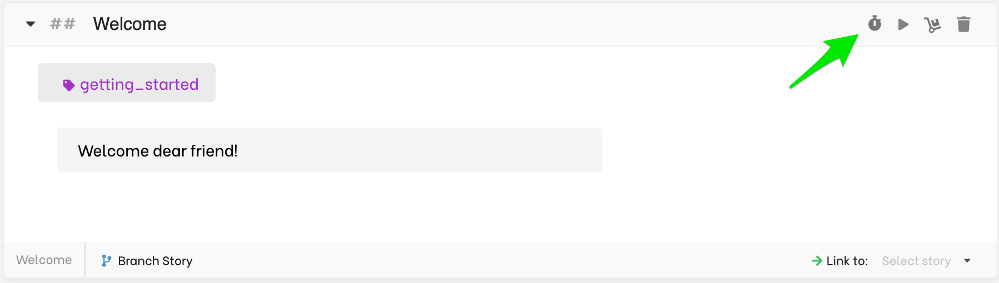

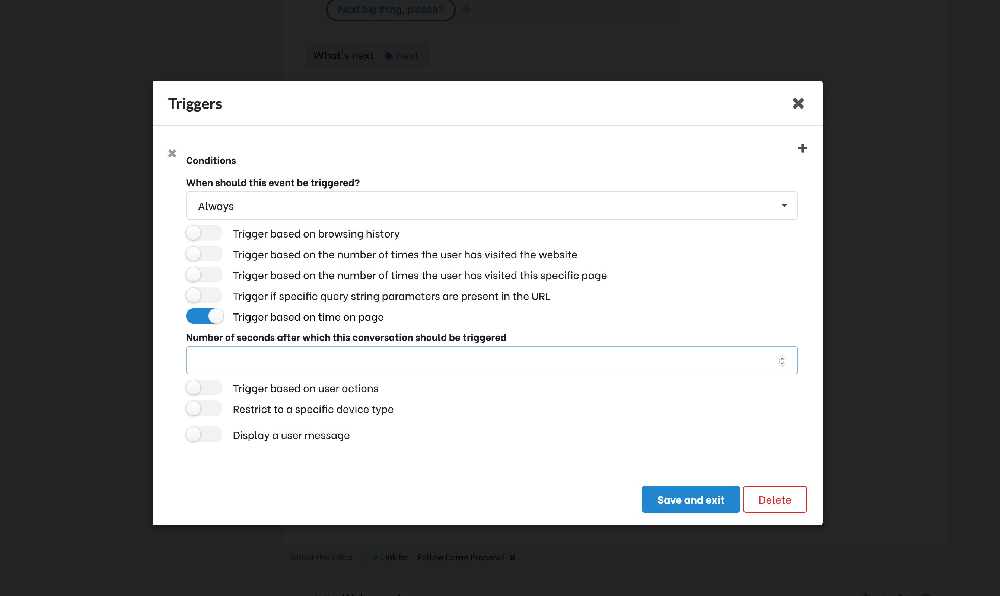

## How it works

It's important to stress that this features only works with with the chat widget installed on your website. This is feature is not available in the open source edition.
The chat widget observes the behavior of users and stores information it in the user's browser's local storage, and is not sent to the server.

### Starting conditions
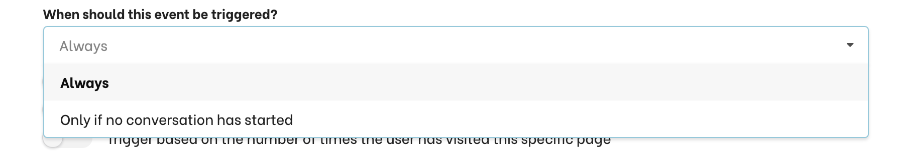

- **Always:** the story will be triggered each time the condition set in this trigger are met.
- **Only if no conversation has started:** the story will be triggered only if the conversation history is empty.
- **Choose a limit:** The story will be triggered each time the condition set in this trigger is met, but only for the number of times set.

## Maximum trigger

Choose how many times you want the rules to be triggered, if you choose 3, it will trigger three times and then never trigger again until you change the trigger rule itself.

## Minimum interval

Choose the minimum ammount of time in minutes between two trigger events in the same story. In the above example, the interval is set to 24 hours, so the trigger will only be able to trigger once every day.

## Trigger a conversation based on landing parameters

You can trigger a conversation tailored to parameters set from an originating link, such as a campaign.
Suppose your visitor comes from a banner click to a url like: `https://your.site/?utm_source=media1`. You may want to start the conversation in a different way than if they came to `https://your.site/?utm_source=media1`.

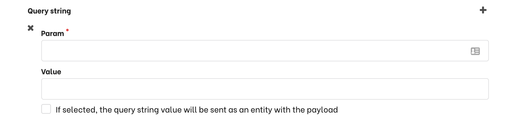

You would set `param` to **utm_source** and `value` to **media1** for one story, and `value` to **media2** for another story.

> Don't forget to define slots accordingly.

#### Using the value in the conversation

In other situations you may want to just use the value of a parameter to make the conversation more personal. In that case you can pass the value of the parameter as an entity.
You can then re-use it directly in your conversation.

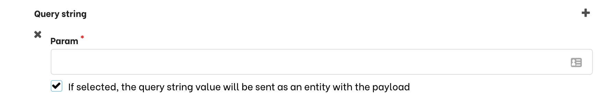

For example, you could send an email to a list of clients with a link to your site, and your bot could greet them by their name.
To do this, the link in the email could have this form: `http://your.site/?first_name=James`. Then you can start by greeting your users like this:

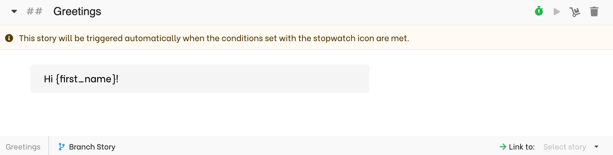

## Trigger a conversation based on a user behavior

### Browsing history
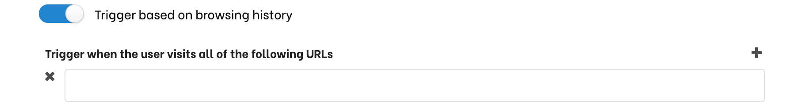

You can set a story to start based on the browsing history of the visitor.

You can add several URLs to your trigger. The conversation will only start when the visitor has visited them all, **regardless of the order**.

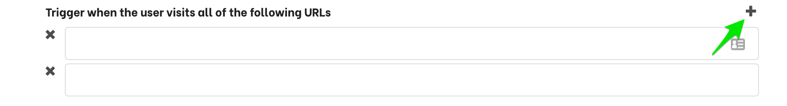

#### Using partial URLS
Although regexes are not supported, you don't have to put an entire URL. For exemple, if you only set `product` it will match any URL containing `product` in the browser history (e.g. `https://yoursite.com/product/features`).

#### Protocol, host, and port
Protocol, host, and port are always ignored. Which means that if you set `http://localhost:8000/product/features` it will also match `https://yoursite.com/product/features`.

### Number of website visits
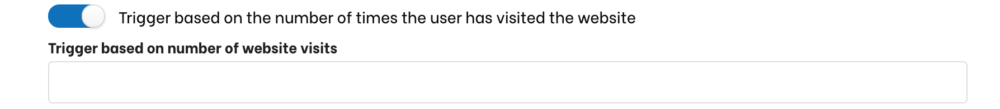

The story will be triggered when the user visits your website. A website is a host. Which means that `www.yoursite.com` and `admin.yoursite.com` are 2 distinct websites.

A new visit only occurs after 30 minutes of inactivity.

### Number of page visits

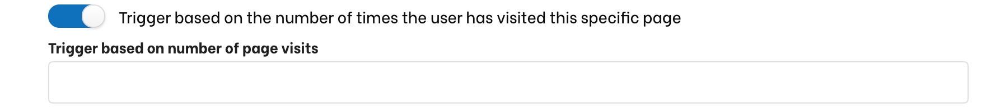

The story will be triggered if the user has visited a specific page a certain number of times.

#### Combining with browsing history
- If no URL is set: the conversation will be triggered as soon as the user visits any page the specified number of times.
- If a list of URLs is set: the conversation will be triggered as soon as the user visits any matching URL the specified number of times.

#### Combining with starting conditions
If **Always** is set, this trigger will apply each time the number of visits is greater or equal to the specified number if visits.

### Time on page

The conversation will be triggered after a user has stayed more than the specified number of seconds on a page. This is generally used in combination with [browsing history](#trigger-story-based-on-browsing-history)

### Events occuring on the page

This allows you to trigger a conversation when a user clicks somewhere, when they enter or exit a form element, etc.
Simply specify the javascript event you want to listen to and the corresponding CSS selector.

### Device type

Use this to start a given conversation only on a computer or mobile device.

### Add a user message
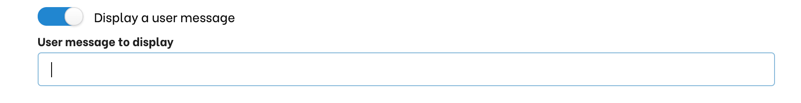

By default, when a conversation is triggered, there will be no user message. It will start by the first response set in the story. Use this if you want the conversation to start by a user message.

## Combining triggers

You can create complex combinations of conditions triggering a conversation. Generally you want different type of combinations:

### Start a conversations when ALL conditions are met (`AND`).

This is the default behaviour when you set a trigger. If you specify multiple rules, the trigger will only be effective when ALL conditions are met.
In the following example, the conversation will only start if the user is visiting a URL matching **products** for the second (or more) time and stays at least 3 seconds on the page.

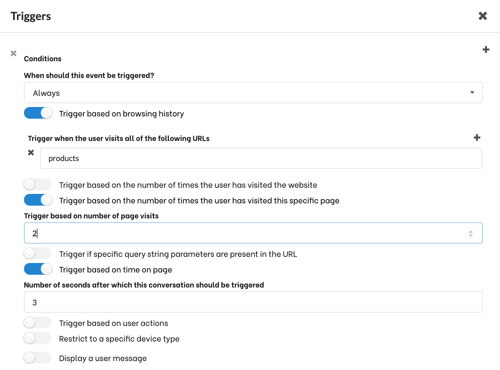

### Start a conversation when ANY condition is met (`OR`).
If you add several triggers, the conversation will start when the conditions set for any triggers are met.
In the following example, the conversation will start either if a user hits a URL matching **products** or if they stay on any page for more than 2 seconds.
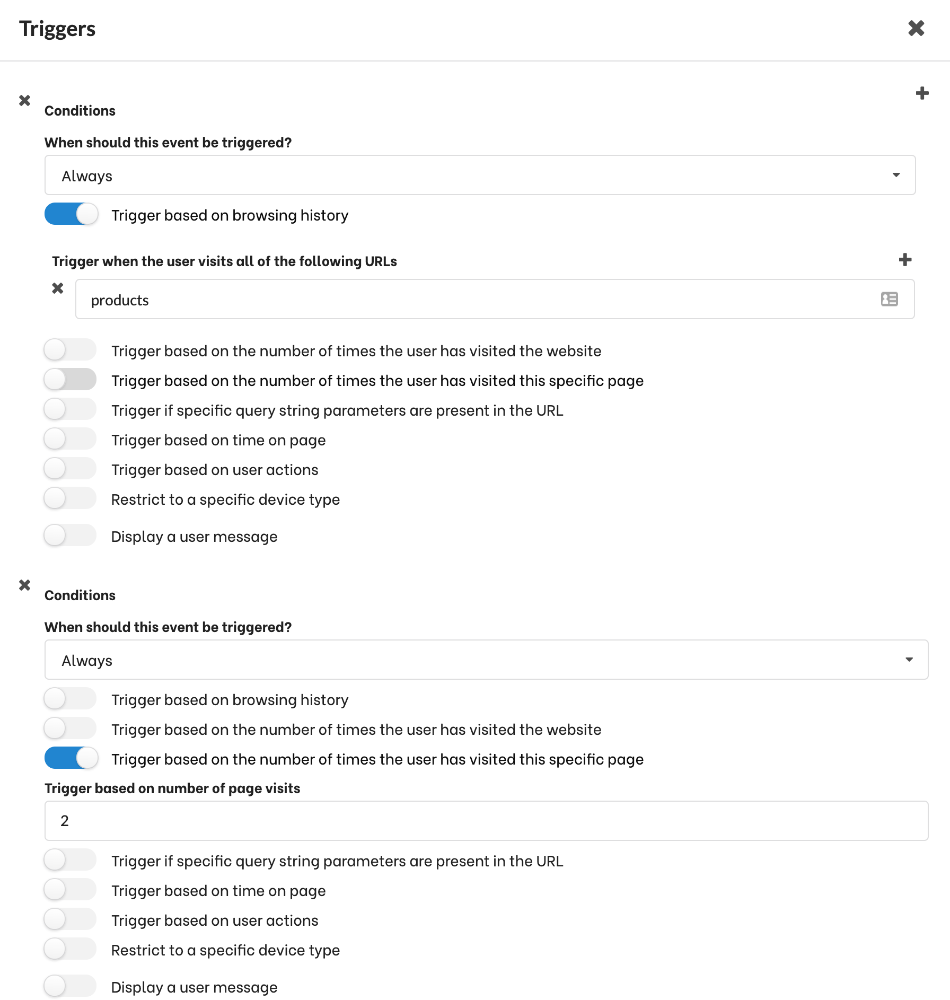

