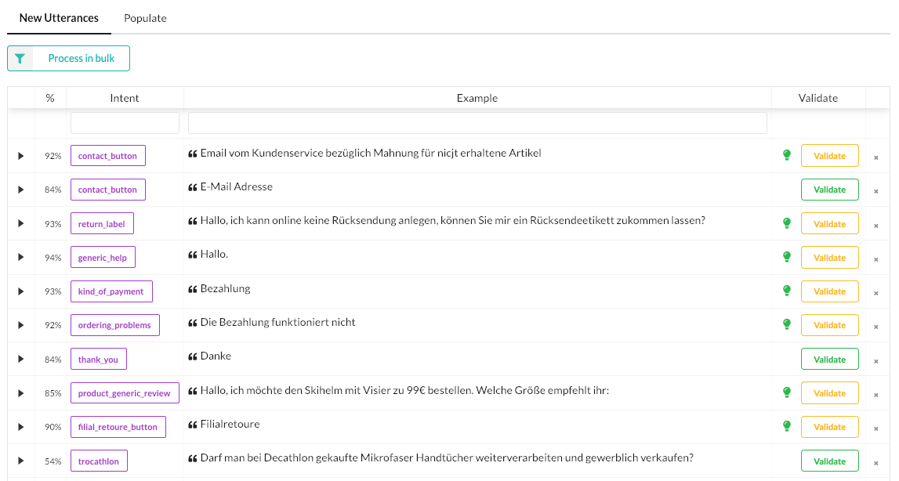
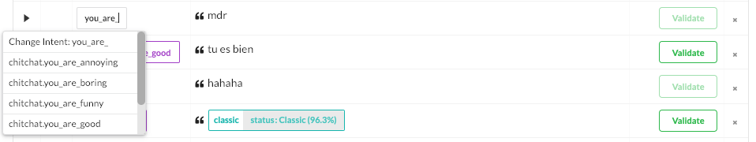

# Model maintenance

New data is consistently flowing in as users talk to your bot. Maintaining your model means processing incoming utterances by means correcting wrong NLU interpretations, validating correct ones, and deciding whether or not to keep this new data.

## Correct and validate

Intents and entities can be corrected in one click, allowing to quickly correct dozens of incoming utterances. Usual annotation tools are also available.

Once an utterance is correct, mark it valid with the `Validate` button. When you have a bunch of new validated examples, you can use them as an evaluation set or add them to the training data.

Validated data gives you the opportunity to evaluate your model on a regular basis with recent data. Then you can use it to augment your training data.
