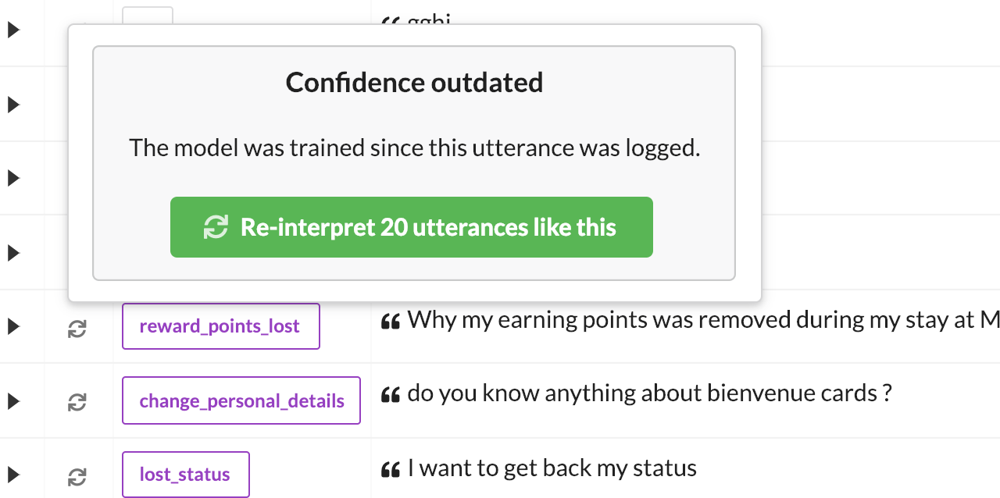

# Model maintenance

New data is consistently flowing in as users talk to your bot. Maintaining your model means processing incoming utterances by means correcting wrong NLU interpretations, validating correct ones, and deciding whether or not to keep this new data.

## Correct and validate

Intents and entities can be corrected in one click, allowing to quickly correct dozens of incoming utterances. Usual annotation tools are also available.

Once an utterance is correct, mark it valid with the `Validate` button. When you have a bunch of new validated examples, you can use them as an evaluation set or add them to the training data.

Validated data gives you the opportunity to evaluate your model on a regular basis with recent data. Then you can use it to augment your training data.

## Controlling growth

New data is good as long as it teaches your model something new, but systematically add everythinh will make your model very large and longer to train. Botfront help you deal with those challenges in an efficient way.

In the example below, “Oui” was interpreted as “basics.yes” with a very high score, the model won’t learn anything from this example so Botfront recommends you to delete it. Botfront looks at your training data before making those suggestions and makes sure, for example, not to suggest to delete an utterance where an entity might be missing.

When you re-train a model, after new data has been added, the scores might not berelevant anymore. That's why they are replaced with a <i class="fas fa-sync-alt"></i> icon. The re-interpret button will send the next 20 utterances to the NLU server with the newly trained model so the scores reflect its latest state.

