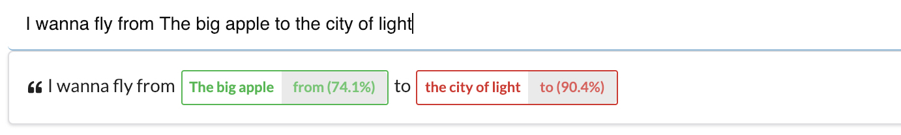

# Training intents and entities

**Intents** capture the general meaning of an utterance while **entities** refer to some particular elements _within_ a sentence. Let's say you create a flight booking bot.

> I want to book a flight from **Paris** to **Montreal**

The intent of the example above is to book a flight from Paris to Montreal. So let's call it `book_flight`. Entities are Paris and Montreal. So let's call them `from` and `to`.

Then we'll need more examples:

> Is there a flight from **Rome** to **London** tomorrow?\
> I wanna fly from **The big apple** to **the city of light**

And in Botfront it's going to look like this:


After you train, you can verify if it works as expected or not by typing a sentence in the _User says..._ section. You can see that the `from` and `to` entities are picked up as expected.



<Important type="tip" title="NOTE">

You don't see an intent here because our dataset only has one intent. You need at least two intents to train an intent classifier.

</Important>

## Filtering entities

Sometimes the NLU can catch en entity that you're next expecting in your stories, and that might affect predictions and dialogue management in general.
You can add the following component to your NLU pipeline to have more control on your payloads.

In the example below:

- If the `buy_shirt` intent is recognized, the payload will only keep the entities `color` and `size` and get rid of any other.
- If the `chitchat.greet` intent is recognized, any entity extracted will be disregarded and removed from the payload.

```yaml
- name: "rasa_addons.components.entities_filter.EntitiesFilter"
  entities:
    buy_shirt: ["color", "size"]
    chitchat.greet: []
```

## Entity synonyms

In the example above, if we really want to pass it to a booking engine or a price comparator, we may need airport codes. Entity synonyms could be used for that. In the example below, we mapped _the city of light_ to CDG and _The big apple_ to JFK in the synonyms, retrained, and the values returned for the entities were **CDG** and **JFK**.


<Important type="tip">

Adding synonyms in the table is generally not enough. You still need to teach the entity extractor the various forms an origin or a destination could take by adding more examples to the training data.

</Important>

We still assume that our users are careful enough to avoid typos and spelling mistakes. Synonyms won't help the model figure it out that the _the big aple_ is **JFK** or that the _citi of lite_ is _CDG_.

However, a fuzzy gazette can.

## Gazettes

Gazettes are useful when you expect the values of an entity to be in a finite set, and when you want to give users some spelling latitude. Common examples are colors, brands, or cities.
In the example below we want to make sure the `color` entity returns an allowed color. The allowed colors are **red** and **blue**. We want to be sure of two things:

1. If the `CRFEntityExtractor` extracts **yellow**, which is not in the whitelist, we don't want it in the NLU parse data.
2. The correct color is returned if the user spells it incorrectly (to some extent).


All you have to do is to specify the list of allowed (or commonly) expected values (there aren't that many ways of saying Paris or New York). The _spelling latitude_ is adjusted with the fuzziness parameter. 100 will have no telerance to errors, 0 will be extremely tolerant. It will always return one of the values even if the user types something completely out of scope.

<Important type="tip" title="NOTE">

When the entity extractor picks up _citi of lite_, it compares it with every element of the Gazette list and computes a fuzziness score for each element. The highest score is for _the city of light_, which is then mapped to _CDG_ by the synonyms processor. If the highest score is below the minimum score, it means the value is out of scope and the entity is removed.

</Important>

## Compositing entities

Duckling is an open source parser by Facebook which is able to extract structured entities such as numbers, amounts of money, emails, dates. It can be used by Rasa and is integrated in the Botfront package (when you start Botfront with the CLI, a Duckling container is started)

Being a parser, it is only able to recognize patterns in a sentence and not to attribute them to specific entities. For example, in the following sentence:

> I want _2_ beers and _3_ cokes

Duckling will return two instances of the `number` entity, but no information about which quantity applies to which beverage.

Luckily, Botfront comes with a component just for that. Simply annotate _2_ as a `beers_count` entity and _3_ as a `cokes_count` entity.

Then add the following component in the pipeline **after** the `CRFEntityExtractor`:

```yaml
- name: CRFEntityExtractor
  ...
- name: rasa_addons.nlu.components.duckling_http_extractor.DucklingHTTPExtractor
  url: http://duckling
  dimensions:
  - "number"

- name: rasa_addons.nlu.components.duckling_crf_merger.DucklingCrfMerger
  entities:
    beers_count: ["number"]
    cokes_count: ["number"]
```

Now, the `beers_count` and `cokes_count` entities are guaranteed to return a value of type number, and your custom actions can safely rely on it. If the `CRFEntityExtractor` extracts an entity that does not contain a `number` it is going to be removed.

<Important type="tip" title="The order is important">

- The entities are first extracted by the `ner_crf` component.
- Duckling extracts numbers
- `DucklingCrfMerger` merges them. The value of `beers_count` will be 2

</Important>

## Configuring the pipeline

For the above to work in our example, we need to make sure things happen in the right order:

1. The `CRFEntityExtractor` component extracts _citi of lite_ from the utterance
2. The `Gazette` component replaces _citi of lite_ with _the city of light_
3. The `EntitySynonymMapper` componenent maps _the city of light_ to _CDG_.

## Semantic variety

Introducing variety is key to build a capable model.

<Important type="tip" title="GOOD">

I want to book a flight from **Paris** to **Montreal**  
Is there a flight from **Rome** to **London** tomorrow?  
I wanna fly from **The big apple** to **the city of light**

</Important>

The following will only get you so far.

<Important type="danger" title="BAD">

I want to book a flight from **Paris** to **Montreal**  
I want to book a flight from **Rome** to **London** tomorrow?  
I want to book a flight from **The big apple** to **the city of light**

</Important>

## Spelling error

Spelling errors can affect both entity extraction and intent classification. We have seen above how gazettes can help with typos in entities but we were also lucky that it worked well with only a few examples.

<Important type="tip">

**Your data set must reflect how users talk to your bot.**  
If your users do spelling mistakes, then your training data should have some too.

</Important>