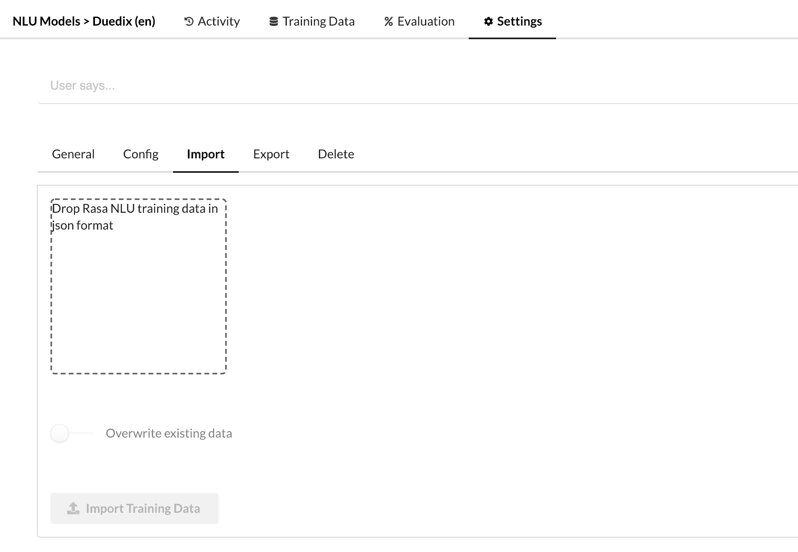
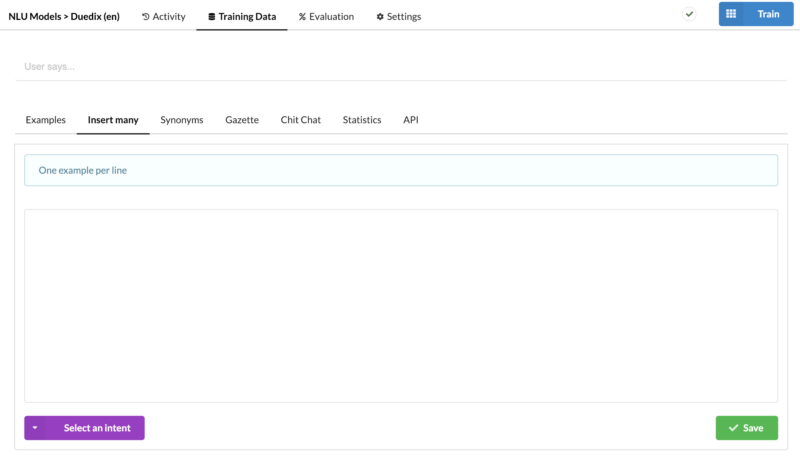
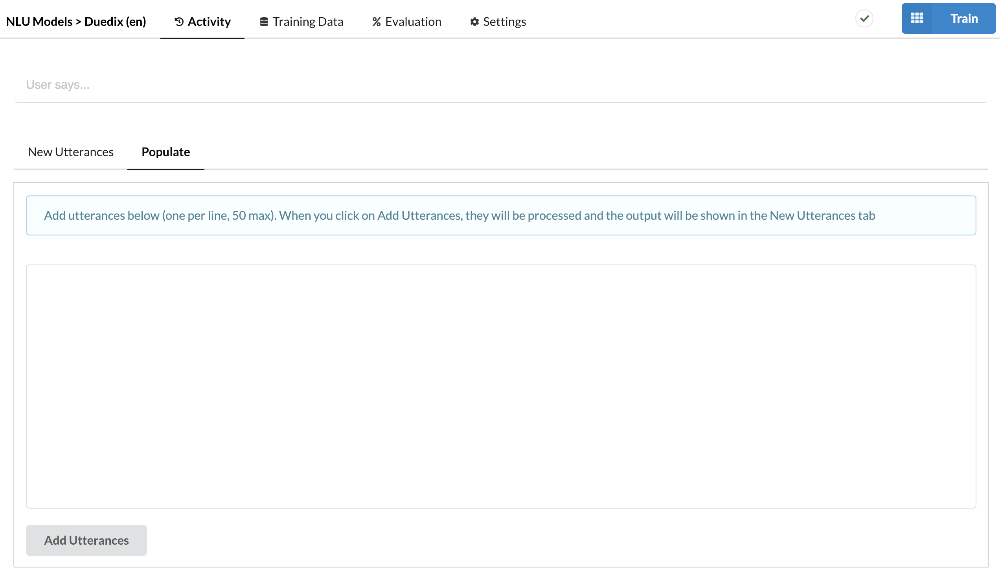
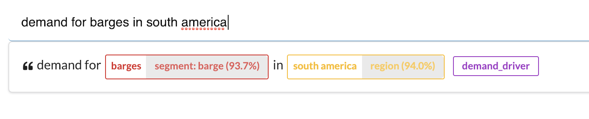
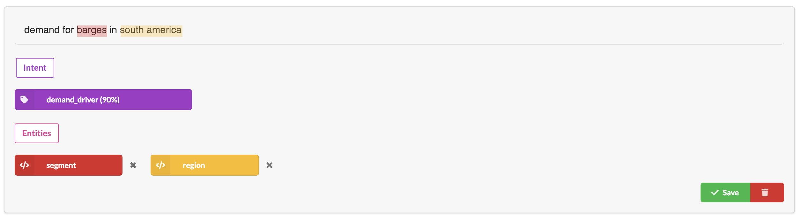

---
meta:
  - name: description
    content: 'Botfront: adding training data in Rasa'
  - name: keywords
    content: botfront stories nlu rasa
permalink: /rasa/nlu/:slug
---

# Add Training data

## Import

One way of adding data is to import it in the Rasa NLU format (JSON). You can do this from **Settings > Import** in your model

## Insert Many

You can also copy and paste or type a bunch of sentences in **Training Data > Insert Many** and select an intent to tag them all at once

## Populate

You can also use **Activity > Populate** to add data.

::: tip
If your model works decently, this can be a fast way to enhance your model: add a few examples, Rasa NLU will interpret them and display the annotated results in the *New Utterances* tab. Making corrections will be very fast, and you might find out that some examples are not that useful. Remember, you should only add more data when it increases the accuracy of your model.
:::  

## NLU Playground

Finally, you can add examples one by one from the NLU playground. Just click on the interpreted example to open the editor:

Then make your annotations and save.

