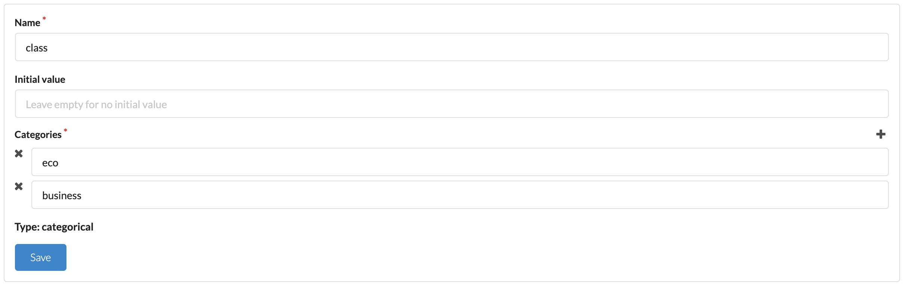
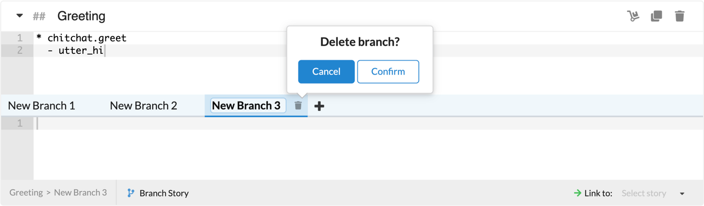

---
meta:
  - name: description
    content: 'Botfront: the most efficient way to write Rasa stories'
  - name: keywords
    content: botfront stories nlu rasa
permalink: /rasa/:slug
---

# Using Rasa Stories

Stories are the building blocks of conversation flows. It's a symbolic language used to describe conversations a user can have with a bot.
In their simplest form, stories are made of user messages, starting with a `*`, and bot responses, starting with a `-`. 

```
* chitchat.greet
  - utter_hi_there
```

```
* chitchat.bye
  - utter_bye
```

As you can see this is not real natural language: the user message is expressed in the form of an **_intent_**, and the bot response with a **_response name_**. The content of this intent (the many ways to say *hi*) and of the bot response (something like *Hello my human friend*) will be defined later

::: tip
This has an important implication: **stories are language agnostic**. The stories you write will work in any language.
:::

## Stories and context

The context of a conversation is the knowledge of all the passed events of this conversation.

In the story above (previous section), if you say **_Hi_** three times to the bot it will reply three times the same thing. To prevent that, consider this example:

```
* chitchat.greet
  - utter_hi_there
* chitchat.greet
  - utter_hi_again
* chitchat.greet
  - utter_hmm_really
```


## Intro and Default stories

The **Intro stories** group contains the initial messages that would be sent to users when they start chatting with your bot. You may create as many stories as you want to be selected as intro stories. You can select the initial payload from the chat widget, which would be based on the stories you created here.

**Default stories** and **Intro stories** groups are created by default on every new project. You may edit/remove the Default stories group as desired. All stories can also be removed from the Intro stories group, but the group itself cannot be deleted.

## Branching conversations

Conversations are often designed as tree-like flow charts. Stories are *real* conversation examples. Simply click on the **Branch Story** button on the story footer:


Which would create two branches by default:


```
* chitchat.greet
- utter_hi_how_are_you
```

### Branching with intents

The simplest way to branch a conversation is to use different intents at some point:


```{3}
* chitchat.greet
  - utter_hi_how_are_you
* chitchat.i_am_happy
  - utter_awesome
```



```{3}
* chitchat.greet
  - utter_hi_how_are_you
* chitchat.i_am_sad
  - utter_i_have_a_bad_day_myself
```


### Branching with entity values

Another way is to use entity values:


```{3}
* chitchat.greet
  - utter_hi_how_are_you
* book{"class":"eco"}
  - utter_eco
  ```


```{3}
* chitchat.greet
  - utter_hi_how_are_you
* book{"class":"business"}
  - utter_business
  ```


```{3}
* chitchat.greet
  - utter_hi_how_are_you
* book
  - utter_which_class
  ```

::: warning But wait, that doesn't work!
If you train and try those stories, you'll see that if you type `/book` the agent will utter `utter_which_class` as expected, but if you type `book{"class":"eco"}` or `book{"class":"business"}` the response will be 
random. The reason is that if the value of the entity is not stored somewhere, Rasa only differentiates flow looking at if the entity `class` exists or not in the user utterance.
:::

::: tip Solution: store entity values in slots
If you want the stories above to work, you need to **create a slot**. In this case we're going to create a **categorical** slot, and add the categories **business** and **eco**. Then retrain and it should work.
:::


### Branching with slots

Once you define a slot with the same name as an entity, any entity value extracted from a user message will be set as the slot value, and this value will persist accross the conversation until it is changed or reset.
It means that if a user said one of the sentences above (`book{"class":"eco"}` or `book{"class":"business"}`), you can still use that information to branch your conversation in other stories. 

**Use case**: a user wants to cancel a booking, but only `business` bookings are cancellable. 

Let's add a new story with two branches:



```{2}
* cancel.booking
  - slot{"class":"eco"}
  - utter_booking_not_cancellable
```


```{2}
* cancel.booking
  - slot{"class":"business"}
  - utter_booking_canceled
```

As you can see, the `- slot{"class":"..."}` in the branches guides the conversation into different paths.

::: tip What if the class has not been set yet?
You can add a third category **not_set** to the `class` slot in a new branch, and set the initial value to **not_set**. Then you can gracefully handle the case where no class is set like this:


```{2}
* cancel.booking
  - slot{"class":"not_set"}
  - utter_which_class
```
:::

### How branches are handled

Under the hood, Botfront uses [Rasa checkpoints](https://rasa.com/docs/rasa/core/stories/#checkpoints). When you click branch, the mother and child stories are linked seamlessly with checkpoints, without the need of additional handling on the front end.

### Other branching features

You can easily see which branch you're on by looking at the breadcrumbs on the story footer:


You can rename the branches as desired by clicking on the branch name and add as many as you want using the **+** icon:


You can delete branches by clicking the trash icon while on the selected branch:


::: warning
Please note that deleting either one of the last two branches would automatically delete the other branch as well. The content in the last remaining branch would be added to the end of the story:
:::


## Additional Story Features

Botfront has additional story features to ease your workflow.

### Story Groups

Stories are grouped in Story Groups in order to keep them neat and tidy. You can create as many story groups as you want and rename them if necessary. When you delete the last story in a story group, the group is also deleted.

### Moving stories between groups

By selecting the **Move** icon as seen below, you may move any story to any story group.


### Duplicating stories

You may duplicate stories using the **Duplicate** icon next to the Move icon

### Renaming stories

Stories can be renamed on the story header.


### Collapsing and expanding stories

In order to easily focus on one or a few stories, you can collapse or expand stories using the caret on the left of the story header.

