---
meta:
  - name: description
    content: 'Botfront: the most efficient way to write Rasa stories'
  - name: keywords
    content: botfront stories nlu rasa
permalink: /rasa/:slug
---

# Develop conversations

Botfront is based on Rasa and provides interfaces to build and edit Rasa stories more efficiently.
The first two sections explain the basics. If you are already familiar with stories, you can safely skip them.

## Rasa stories

Stories are the building blocks of conversation flows. It's a symbolic language used to describe conversations a user can have with a bot.
In their simplest form, stories are made of user messages, starting with a `*`, and bot responses, starting with a `-`.

```
* chitchat.greet
  - utter_hi_there
```

```
* chitchat.bye
  - utter_bye
```

As you can see this is not real natural language: the user message is expressed in the form of an **_intent_**, and the bot response with a **_response name_**. The content of this intent (the many ways to say *hi*) and of the bot response (something like *Hello my human friend*) will be defined later

::: tip
This has an important implication: **stories are language agnostic**. The stories you write will work in any language.
:::

## Stories and context

The context of a conversation is the knowledge of all the passed events of this conversation.

In the story above (previous section), if you say **_Hi_** three times to the bot it will reply three times the same thing. To prevent that, consider this example:

```
* chitchat.greet
  - utter_hi_there
* chitchat.greet
  - utter_hi_again
* chitchat.greet
  - utter_hmm_really
```

## Branching conversations

Conversations are often designed as tree-like flow charts. Stories are *real* conversation examples. Simply click on the **Branch Story** button on the story footer:

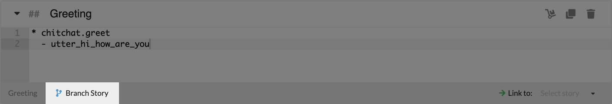

### Branching with intents

The simplest way to branch a conversation is to use different intents at some point. Consider the following stories.

```{3}
* chitchat.greet
  - utter_hi_how_are_you
* chitchat.i_am_happy
  - utter_awesome
```

```{3}
* chitchat.greet
  - utter_hi_how_are_you
* chitchat.i_am_sad
  - utter_i_have_a_bad_day_myself
```

Those stories implement two different paths, one where the user is happy and one where the user is not. Observe that half of the story is duplicated. It may not be a problem here, but when your tree branches on several levels this may become difficult to maintain. That is where the **branch story** option becomes useful:


### Branching with entity values

Another way is to use entity values. Here we want to implement the following use case: a user can ask to book in _eco_ or _business_. The third story covers the case where no class is specified.

```{3}
* chitchat.greet
  - utter_hi_how_are_you
* book{"class":"eco"}
  - utter_eco
```

```{3}
* chitchat.greet
  - utter_hi_how_are_you
* book{"class":"business"}
  - utter_business
```

```{3}
* chitchat.greet
  - utter_hi_how_are_you
* book
  - utter_which_class
```

And this can be done as follows with branches:

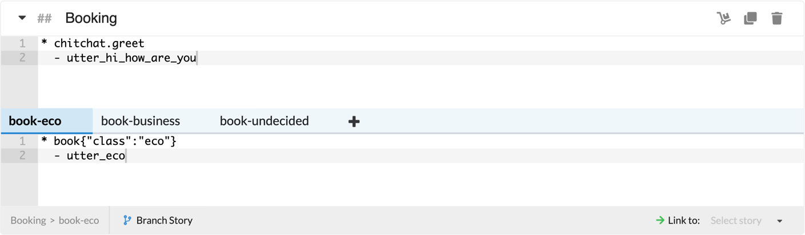

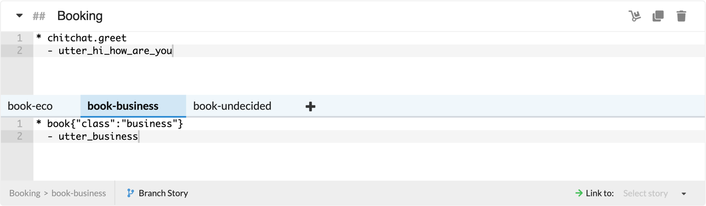


::: warning But wait, that doesn't work!
If you train and try those stories, you'll see that if you type `/book` the agent will utter `utter_which_class` as expected, but if you type `book{"class":"eco"}` or `book{"class":"business"}` the response will be.
random. The reason is that if the value of the entity is not stored somewhere, Rasa only differentiates flow looking at if the entity `class` exists or not in the user utterance.

If you want the stories above to work, you need to **create a slot**. In this case we're going to create a **categorical** slot, and add the categories **business** and **eco**. Then retrain and it should work.


:::

### Branching with slots

Once you define a slot with the same name as an entity, any entity value extracted from a user message will be set as the slot value, and this value will persist accross the conversation until it is changed or reset.
It means that if a user said one of the sentences above (`book{"class":"eco"}` or `book{"class":"business"}`), you can still use that information to branch your conversation in other stories.

**Use case**: a user wants to cancel a booking, but only `business` bookings are cancellable.

In plain text file you would have to write the following stories:

```{2}
* cancel.booking
  - slot{"class":"eco"}
  - utter_booking_not_cancellable
```

```{2}
* cancel.booking
  - slot{"class":"business"}
  - utter_booking_canceled
```

You can implement that as follows with branches:

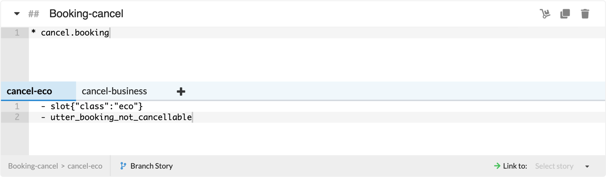


As you can see, the `- slot{"class":"..."}` in the branches guides the conversation into different paths.

::: tip What if the class has not been set yet?
You can add a third category **not_set** to the `class` slot in a new branch, and set the initial value to **not_set**. Then you can gracefully handle the case where no class is set like this:


This is the equivalent of adding this story in a story file.

```{2}
* cancel.booking
  - slot{"class":"not_set"}
  - utter_which_class
```

:::

### How branches are handled

Under the hood, Botfront uses [Rasa checkpoints](https://rasa.com/docs/rasa/core/stories/#checkpoints). When you click **branch story**, the parent and child stories are linked seamlessly with checkpoints, without the need of additional handling on the front end.

### Other branching features

You can easily see which branch you're on by looking at the breadcrumbs on the story footer:


You can rename the branches as desired by clicking on the branch name and add as many as you want using the **+** icon:


You can delete branches by clicking the trash icon while on the selected branch:


::: tip NOTE
Deleting either one of the last two branches would automatically delete the other branch as well. The content in the last remaining branch will be added to the parent story.
:::


## Linking stories

Linking stories is a powerful way to prevent repetition, and to easily connect stories with each other. You may simply select a story as a destination on the right side of the story footer. Any story can be linked to any story, or be used as a destination. This feature is especially useful where you would want to present a frequently repeated flow in the end of multiple stories, like a **feedback** flow.

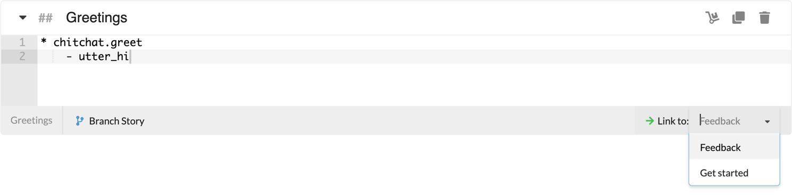

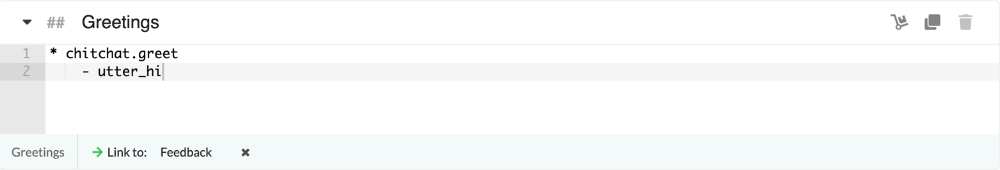

When a story is set as a destination, this is shown by a yellow information bar on the story header.

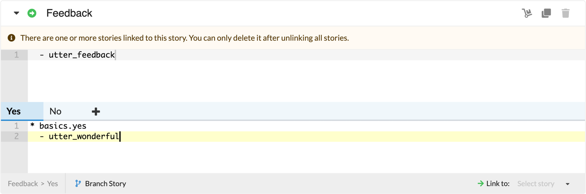

A list of linked stories would be available when clicked on the bar.

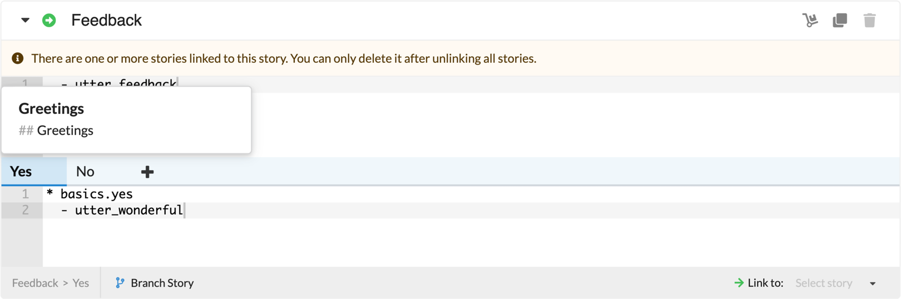

Stories that are destination stories or that have links cannot be deleted until the linking is removed.

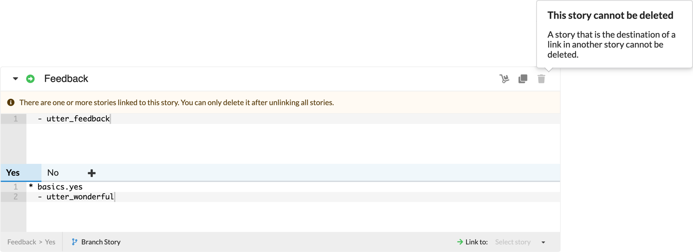

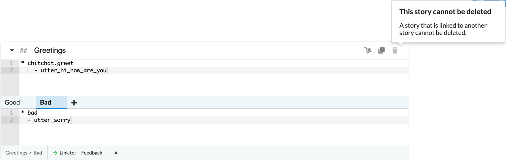

Branches can be linked to other stories as well.

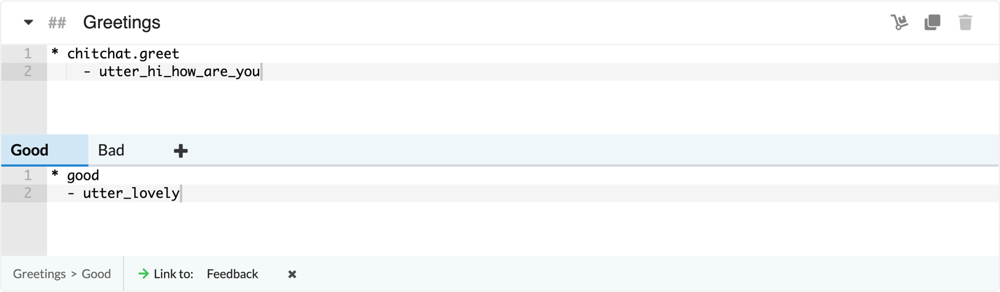

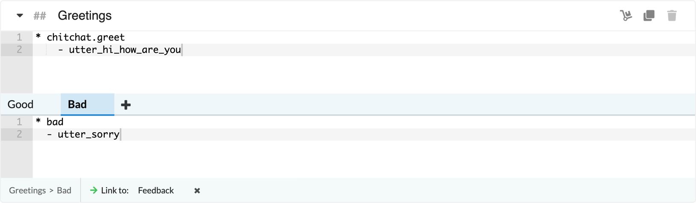

::: tip
Using linking too much could overcomplicate your story flows, making them difficult to understand. Also, excessive usage could lead into an increase training time.
:::

### How linking is handled

Similar to branching, Botfront uses [Rasa checkpoints](https://rasa.com/docs/rasa/core/stories/#checkpoints) to accommodate linking as well. When you click **Link to**, the originating and destination stories are linked seamlessly with checkpoints. Please note that `> checkpoints` are not allowed in stories.

## Organizing your stories in groups

Stories are grouped in story groups in order to keep them neat and tidy. You can create as many story groups as you want and rename them if necessary. When you delete the last story in a story group, the group is also deleted.

By selecting the **Move** icon as seen below, you may move any story to any story group.


<!---
### Duplicating stories

You may duplicate stories using the **Duplicate** icon next to the Move icon.
--->

### Renaming stories

Stories can be renamed on the story header.


### Collapsing and expanding stories

In order to easily focus on one or a few stories, you can collapse or expand stories using the caret on the left of the story header.

### Special group: Intro stories

The **Intro stories** group contains the initial messages that would be sent to users when they start chatting with your bot. The starting payloads of those stories
will be available in the **bold** menu at the top of the chat widget.

This allows to test different starting workflows, for example if you want the welcome message of your bot to be different on several pages of your website. Note that you will still have to implement that on your frontend. If you are using the Rasa Webchat widget you can do that by customizing the `initPayload` parameter.

The **Intro stories** group is created by default in every new project.

## Optimize training for faster development

By default, the NLU and all stories are trained when you click on **Train everything** on the right side of the header in Botfront.
Depending on the policies you are using and the number of stories, training can take a significant amount of time. To help you iterate faster on subsets of your dialogue, you may focus on one or multiple story group to train the NLU and just the stories they contain.

You may click on the **focus (eye)** icon which appears when you hover besides story group names. Please note that the blue Train everything button will change to a yellow **Partial training** button, and it will have a tooltip stating the number of stories that are going to be trained.


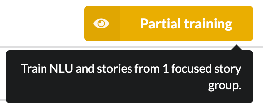

## Warnings and errors

The display of warnings and errors is a very useful part of the story editor. It guides you when you write your stories for them to work properly, and prevents training if there's an error that would affect the model and the chat experience.

When there is a warning or an error, it is flagged on the corresponding line, and also indicated on the story header. When you hover over the icon, you get a suggestive explanation to resolve the issue.

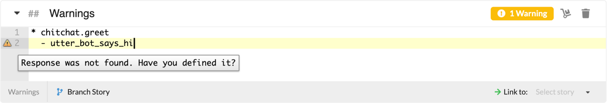


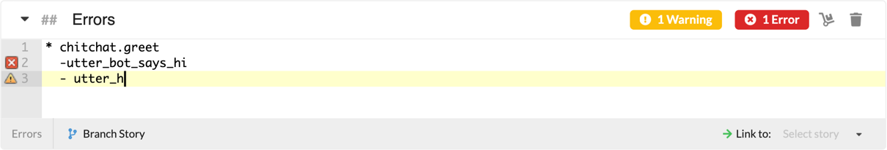

Warnings and errors cover a comprehensive list of possible situations, which are in line with Botfront updates.

## Default Domain Management

An important part of developing and maintaining a Rasa virtual assistant is keeping [domain files](https://rasa.com/docs/rasa/core/domains/) up to date. Thankfully, Botfront makes this easier by automatically parsing the contents of your stories and extracting the different actions, entities, slots, etc. referenced within.

However, it’s not always possible to infer everything that needs to go into the domain. For example, you might need to invoke a custom action, which in turn invokes another action, or makes use of a slot.

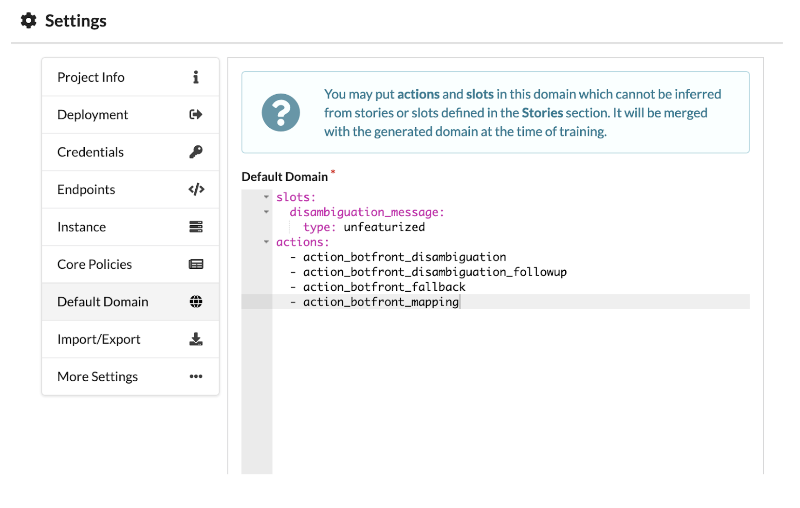

## Disambiguatinf user input

When your virtual assistant receives a user utterance, it calculates, for each intent in your domain, the confidence that the utterance is an instance of that intent. Sooner or later, your virtual assistant will be faced with utterances where none of the calculated confidences are particularly high.

It’s very often best to treat these cases separately, since it may mean that your virtual assistant does not understand, or is unsure. Within the Rasa framework, this is done using [policies](https://rasa.com/docs/rasa/core/policies/).

#### Example usage

```
policies:
...
  - name: rasa_addons.core.policies.BotfrontDisambiguationPolicy
    fallback_trigger: 0.30
    disambiguation_trigger: '$0 < 2 * $1'
    deny_suggestions: 'deny_suggestions'
    n_suggestions: 3
    excluded_intents:
      - ^chitchat\..*
    disambiguation_title:
      en: "Sorry, I'm not sure I understood. Did you mean..."
      fr: "J'ai mal compris. Voulez-vous dire..."
    intent_mappings:
      password_lost:
        en: "Lost password"
        fr: "Mot de passe perdu"
      login_failed:
        en: "Login failed"
        fr: "Problème de connexion"
    deny_suggestions:
      en: "Something else"
      fr: "Autre chose"
...
```

#### Parameters


| Parameter | What it does | type |
| ------- | --------------- |--------------- |
|`fallback_trigger`| if confidence of top-ranking intent is below this threshold, fallback is triggered. Fallback is an action that utters the template `utter_fallback` and returns to the previous conversation state. | `string` |
|`disambiguation_trigger`| e.g.: `'$0 < 2 * $1'`): if this expression holds, disambiguation is triggered. (If it has already been triggered on the previous turn, fallback is triggered instead.) Here this expression resolves to "the score of the top-ranking intent is below twice the score of the second-ranking intent". Disambiguation is an action that lets the user to choose from the top-ranking intents using a button prompt.<br/><br/>In addition, an 'Other' option is shown with payload defined in `deny_suggestions` param is shown. It is up to the conversation designer to implement a story to handle the continuation of this interaction. | `string` |
|`deny_suggestions`| The intent associated in the payload for the 'Other' option. | `string` |
|`excluded_intents`| Any intent (exactly) matching one of these regular expressions will not be shown as a suggestion. | `string` |
|`disambiguation_title`| Localized disambiguation message title. | `object` |
|`intent_mappings`| localized representative button title for intents. If no title is defined for a given intent, the intent name is rendered instead. These titles support entity substitution: any entity name enclosed in curly brackets (`{entity}`) will be filled with entity information from the user utterance. | `object` |

::: tip Important

The title for the 'Other' option is also defined here.

:::
