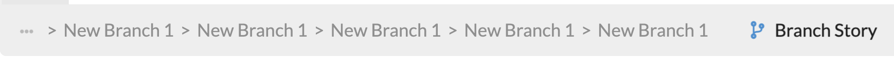

---
meta:
  - name: description
    content: 'Botfront: the most efficient way to write Rasa stories'
  - name: keywords
    content: botfront stories nlu rasa
permalink: /rasa/:slug
---

# Conversation flows

## Branching conversations

Conversations are often designed as tree-like flow charts. Stories are *real* conversation examples. Simply click on the **Branch Story** button on the story footer:

:::: tabs

::: tab "Conversation builder"


:::

::: tab "Botfront Markdown"


:::

::::

Several events can be at the beginning of branches:

- user utterances (intents and entities)
- slots (context)

### Branching with intents

The simplest way to branch a conversation is to use different intents at some point. Consider the following stories where two different paths (_happy_ and _sad_) are implemented:

:::: tabs

::: tab "Conversation builder"


:::

::: tab "Botfront Markdown"


:::

::: tab "Standard Rasa"

_For Rasa, you need to create two separate stories, where half of the story is duplicated. It may not be a big problem in a simple implementation like this, but when your conversation tree branches on several levels,this will become very difficult to maintain._

``` md {3}
* chitchat.greet
  - utter_hi_how_are_you
* chitchat.i_am_happy
  - utter_awesome
```

``` md {3}
* chitchat.greet
  - utter_hi_how_are_you
* chitchat.i_am_sad
  - utter_i_have_a_bad_day_myself
```

:::

::::

### Branching with entity values

Another way is to use entity values. You can check how you can annotate with entities in the [conversation builder guide](/rasa/conversation-builder/#annotating-with-entities).

Here we want to implement the following use case: a user can ask to book in _eco_ or _business_. The third path covers the case where no class is specified. This can be done as follows with branches:

:::: tabs

::: tab "Conversation builder"


:::

::: tab "Botfront Markdown"


:::

::: tab "Standard Rasa"

_Similar to the previous example, here Rasa requires three separate stories with a lot of duplication:_

``` md {3}
* chitchat.greet
  - utter_hi_how_are_you
* book{"class":"eco"}
  - utter_eco
```

``` md {3}
* chitchat.greet
  - utter_hi_how_are_you
* book{"class":"business"}
  - utter_business
```

``` md {3}
* chitchat.greet
  - utter_hi_how_are_you
* book
  - utter_which_class
```

:::

::::

::: warning But wait, that doesn't work!
If you train and try this story, you'll see that if you type `/book` the agent will utter `utter_which_class` as expected, but if you type `/book{"class":"eco"}` or `/book{"class":"business"}` the response will be random. The reason is that if the value of the entity is not stored somewhere, Rasa only differentiates the flow looking at if the entity `class` exists or not in the user utterance.

If you want the stories above to work, you need to **create a slot**. In this case we're going to create a **categorical** slot, and add the categories **business** and **eco**. Then retrain and it should work.


:::

### Branching with slots

Once you define a slot with the same name as an entity, any entity value extracted from a user message will be set as the slot value, and this value will persist accross the conversation until it is changed or reset. This means that if a user said one of the sentences above (_I want to book in economy_ `book{"class":"eco"}` or _I want to book in business_`book{"class":"business"}`), you can still use that information to branch your conversation.

**Use case**: a user wants to cancel a booking, but only `business` bookings are cancellable. You can implement that as follows with branches:

:::: tabs

::: tab "Conversation builder"


:::

::: tab "Botfront Markdown"


:::

::: tab "Standard Rasa"

_In Rasa, you would have to write two additional separate stories:_

``` md {2}
* cancel.booking
  - slot{"class":"eco"}
  - utter_booking_not_cancellable
```

``` md {2}
* cancel.booking
  - slot{"class":"business"}
  - utter_booking_canceled
```

:::

::::

As you can see, the `- slot{"class":"..."}` in the branches guides the conversation into different paths.

::: tip What if the class has not been set yet?
You can add a third category **not_set** to the `class` slot in a new branch, and set the initial value to **not_set**. Then you can gracefully handle the case where no class is set like this:

:::

:::: tabs

::: tab "Conversation builder"


:::

::: tab "Botfront Markdown"


:::

::: tab "Standard Rasa"

``` md {2}
* cancel.booking
  - slot{"class":"not_set"}
  - utter_which_class
```

:::

::::

### How branches are handled

Under the hood, Botfront uses [Rasa checkpoints](https://rasa.com/docs/rasa/core/stories/#checkpoints). When you click **branch story**, the parent and child stories are linked seamlessly with checkpoints, without the need of additional handling on the front end.

### Other branching features

You can easily see which branch you're on by looking at the breadcrumbs on the story footer:



You can rename the branches as desired by clicking on the branch name and add as many as you want using the **+** icon:

:::: tabs

::: tab "Conversation builder"


:::

::: tab "Botfront Markdown"


:::

::::

You can delete branches by clicking the trash icon while on the selected branch:

:::: tabs

::: tab "Conversation builder"


:::

::: tab "Botfront Markdown"


:::

::::

::: tip NOTE
Deleting either one of the last two branches would automatically delete the other branch as well. The content in the last remaining branch will be added to the parent story.
:::

:::: tabs

::: tab "Conversation builder"


:::

::: tab "Botfront Markdown"


:::

::::


## Linking stories

Linking stories is a powerful way to prevent repetition, and to easily connect stories with each other. You may simply select a story as a destination on the right side of the story footer. Any story can be linked to any story, or be used as a destination. This feature is especially useful where you would want to present a frequently repeated flow in the end of multiple stories, like a **feedback** flow.

:::: tabs

::: tab "Conversation builder"


:::

::: tab "Botfront Markdown"


:::

::::

When a story is set as a destination, this is shown by a yellow information bar on the story header.

:::: tabs

::: tab "Conversation builder"


:::

::: tab "Botfront Markdown"


:::

::::

A list of linked stories would be available when clicked on the bar.

:::: tabs

::: tab "Conversation builder"


:::

::: tab "Botfront Markdown"


:::

::::

Stories that are destination stories or that have links cannot be deleted until the linking is removed.

:::: tabs

::: tab "Conversation builder"


:::

::: tab "Botfront Markdown"


:::

::::

Branches can be linked to other stories as well.

:::: tabs

::: tab "Conversation builder"


:::

::: tab "Botfront Markdown"


:::

::::

::: tip
Using linking too much could overcomplicate your story flows, making them difficult to understand. Also, excessive usage could lead into an increase in training time.
:::

### Linking a story to itself

Linking a story to itself is only available on a story that has branches. For example, this can be used to create a menu dialogue, with a "go back" option looping back to the start of the story.
However, when using this feature, the story that is linking to itself also needs to be a destination story of another story, that will serve as an introduction story to the loop. **Otherwise, the self linking story would not be reachable.**

Schema of a self linking story (Menu story) with an intro story:


A sample self-linked story:

:::: tabs

::: tab "Conversation builder"


:::

::: tab "Botfront Markdown"


:::

::::

### How linking is handled

Similar to branching, Botfront uses [Rasa checkpoints](https://rasa.com/docs/rasa/core/stories/#checkpoints) to accommodate linking as well. When you click **Link to**, the originating and destination stories are linked seamlessly with checkpoints. Please note that `> checkpoints` are not allowed in stories.
