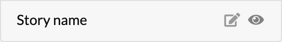
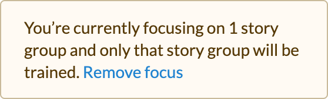
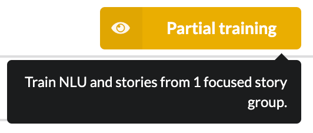

---
meta:
  - name: description
    content: 'Optimization'
  - name: keywords
    content: botfront stories nlu rasa slots
permalink: /rasa/:slug
---

# Optimization

## Optimize training for faster development

By default, the NLU and all stories are trained when you click on **Train everything** on the right side of the header in Botfront.
Depending on the policies you are using and the number of stories, training can take a significant amount of time. To help you iterate faster on subsets of your dialogue, you may focus on one or multiple story group to train the NLU and just the stories they contain.

You may click on the **focus (eye)** icon which appears when you hover besides story group names. Please note that the blue Train everything button will change to a yellow **Partial training** button, and it will have a tooltip stating the number of stories that are going to be trained.








## Default Domain Management

An important part of developing and maintaining a Rasa virtual assistant is keeping [domain files](https://rasa.com/docs/rasa/core/domains/) up to date. Thankfully, Botfront makes this easier by automatically parsing the contents of your stories and extracting the different actions, entities, slots, etc. referenced within.

However, it’s not always possible to infer everything that needs to go into the domain. For example, you might need to invoke a custom action, which in turn invokes another action, or makes use of a slot.


## Disambiguation user input

When your virtual assistant receives a user utterance, it calculates, for each intent in your domain, the confidence that the utterance is an instance of that intent. Sooner or later, your virtual assistant will be faced with utterances where none of the calculated confidences are particularly high.

It’s very often best to treat these cases separately, since it may mean that your virtual assistant does not understand, or is unsure. Within the Rasa framework, this is done using [policies](https://rasa.com/docs/rasa/core/policies/).

#### Example usage

```
policies:
...
  - name: rasa_addons.core.policies.BotfrontDisambiguationPolicy
    fallback_trigger: 0.30
    disambiguation_trigger: '$0 < 2 * $1'
    deny_suggestions: 'deny_suggestions'
    n_suggestions: 3
    excluded_intents:
      - ^chitchat\..*
    disambiguation_title:
      en: "Sorry, I'm not sure I understood. Did you mean..."
      fr: "J'ai mal compris. Voulez-vous dire..."
    intent_mappings:
      password_lost:
        en: "Lost password"
        fr: "Mot de passe perdu"
      login_failed:
        en: "Login failed"
        fr: "Problème de connexion"
    deny_suggestions:
      en: "Something else"
      fr: "Autre chose"
...
```

#### Parameters

| Parameter | What it does | type |
| ------- | --------------- |--------------- |
|`fallback_trigger`| if confidence of top-ranking intent is below this threshold, fallback is triggered. Fallback is an action that utters the template `utter_fallback` and returns to the previous conversation state. | `string` |
|`disambiguation_trigger`| e.g.: `'$0 < 2 * $1'`): if this expression holds, disambiguation is triggered. (If it has already been triggered on the previous turn, fallback is triggered instead.) Here this expression resolves to "the score of the top-ranking intent is below twice the score of the second-ranking intent". Disambiguation is an action that lets the user to choose from the top-ranking intents using a button prompt.<br/><br/>In addition, an 'Other' option is shown with payload defined in `deny_suggestions` param is shown. It is up to the conversation designer to implement a story to handle the continuation of this interaction. | `string` |
|`deny_suggestions`| The intent associated in the payload for the 'Other' option. | `string` |
|`excluded_intents`| Any intent (exactly) matching one of these regular expressions will not be shown as a suggestion. | `string` |
|`disambiguation_title`| Localized disambiguation message title. | `object` |
|`intent_mappings`| localized representative button title for intents. If no title is defined for a given intent, the intent name is rendered instead. These titles support entity substitution: any entity name enclosed in curly brackets (`{entity}`) will be filled with entity information from the user utterance. | `object` |

::: tip Important

The title for the 'Other' option is also defined here.

:::
