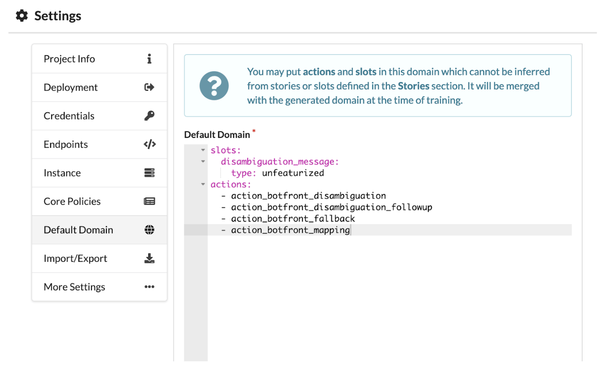

import { FaEye } from "react-icons/fa";

# Advanced features

## Optimize training for faster development

By default, the NLU and all stories are trained when you click on **Train everything** on the right side of the header in Botfront.
Depending on the policies you are using and the number of stories, training can take a significant amount of time. To help you iterate faster on subsets of your dialogue, you may focus on one or multiple story group to train the NLU and just the stories they contain.

You may click on the  <FaEye size='0.8rem'/>  icon which appears when you hover besides story group names. When story groups have this feature enabled, training will be restricted to the stories of those groups.

## Default Domain Management

An important part of developing and maintaining a Rasa virtual assistant is keeping [domain files](https://rasa.com/docs/rasa/core/domains/) up to date. Thankfully, Botfront makes this easier by automatically parsing the contents of your stories and extracting the different actions, entities, slots, etc. referenced within.

However, it’s not always possible to infer everything that needs to go into the domain. For example, you might need to invoke a custom action, which in turn invokes another action, or makes use of a slot.

