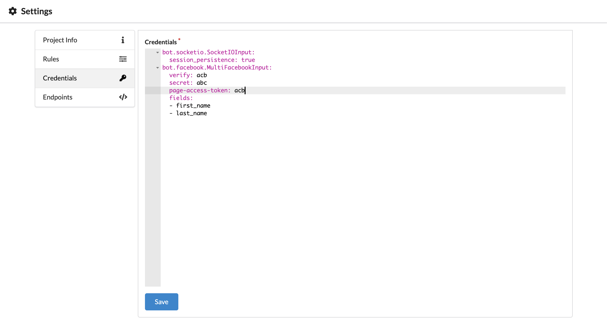

# Credentials

The credentials screen contains all the information Rasa Core needs to connect to various channels.



::: warning
Botfront has specific features that are not natively supported by Rasa Core. It is multilingual, and bot responses support sequences of messages. For this reasons, native Rasa Core channels may not work. Botfront currently provides 2 channels: the socketio (Webchat) and Facebook. 
:::

## SocketIO (Rasa Webchat)

The SocketIO channel connects Rasa Core to the [Rasa Webchat](https://github.com/mrbot-ai/rasa-webchat)

There isn't much to configure here, you can just set the `session_persistent` param to `false` if you prefer create a new session each time the user reloads the page containing the widget

```yaml
bot.socketio.SocketIOInput:
  session_persistence: true
```

## Facebook

This channel inherits from the [Rasa Core Facebook channel](https://rasa.com/docs/core/connectors/#facebook-setup). Besides supporting multilingual and sequence of messages features, it provides a better support for Messenger specific templates features.

```yaml
bot.facebook.MultiFacebookInput:
  verify: <verify phrase>
  secret: <facebook app secret>
  page-access-token: <facebook page token>
  fields:
  - first_name
  - last_name
  - ...
```

Only the `fields` field is specific to Botfront. You can retrieve user profile information in bot responses using the following template format: `{user_<field>}`. For example:


You need special permissions to access profile info (except first and last name). The `fields` fields let you specify the fields the channel is allowed to query from the Facebook Profile API.


::: warning IMPORTANT
You must restart Rasa Core for your changes to take effect. If you are running Botfront with **docker-compose** you can run `docker-compose restart core`
:::