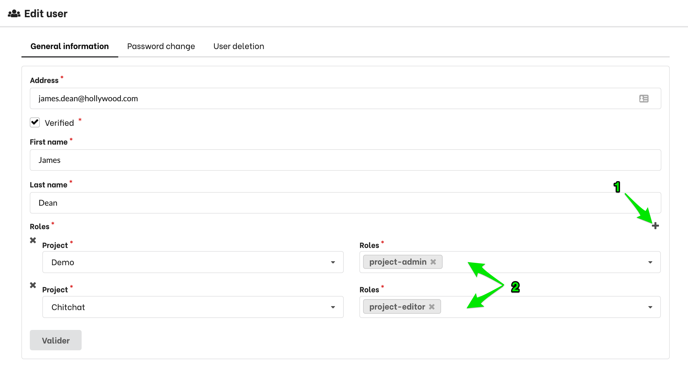
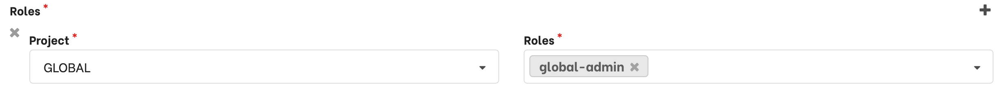

Available in: <Premium plan="Botfront Enterprise" />

# RBAC (Role based access control)

The Enterprise Edition allows you to create multiple projects and users.
Additionnally you can assign roles to users.

## Roles and permissions

Botfront uses a hierarchical persmissions system. Internally there is no difference between a role and a persmission as the system is based on inheritance.

The difference resides in the naming convention. A permission has a `[resource]:[action]` syntax (e.g `nlu-data:x`), while the role has no constraint.

While you can create arbitrary roles and permissions in the UI, you can only assign roles to users.

## Built-in roles

| Role            | Description                                                                                             | constraint    |
|-----------------|---------------------------------------------------------------------------------------------------------|---------------|
| `project-admin` | Can access and edit all resources of a project. Extends `projects:w`, `users:w`                          | `[projectId]` |
| `global-admin`  | Can access and edit all resources of all projects and edit global settigs. Extends All permissions      |               |

## Creating new roles

To create a new role, Go to **Admin -> Roles**, and click the **Create role** button.

The give your role a **name**, **description**, and select the child roles.
Here, we're creating a role that has access to all project resources, but cannot edit project settings, name, etc.

## Assign roles to users

In the user page:
1. Click the **+** to create an assignment.
2. Select the project (left dropdown) and role (right dropdown). Note that you can give one user access to several projects with different roles

To give someone the **global-admin** role, you must select **GLOBAL** in the projects dropdown:

## Built-in permissions

| Permission          | Description                                                                                                                                                                           | Constraint    |
|---------------------|---------------------------------------------------------------------------------------------------------------------------------------------------------------------------------------|---------------|
| `nlu-data:r`        | Can read NLU data.                                                                                                                                                                    | `[projectId]` |
| `nlu-data:w`        | Can write NLU data. Extends `nlu-data:r`.                                                                                                                                             | `[projectId]` |
| `nlu-data:x`        | Can train a model.                                                                                                                                                                    | `[projectId]` |
| `responses:r`       | Can read bot responses.                                                                                                                                                               | `[projectId]` |
| `responses:w`       | Can create, delete and edit bot responses. Extends `responses:r`.                                                                                                                     | `[projectId]` |
| `stories:r`         | Can read story content. Extends `nlu-data:r`, `responses:r`.                                                                                                                          | `[projectId]` |
| `stories:w`         | Can create, delete and edit stories. Extends `stories:r`.                                                                                                                             | `[projectId]` |
| `triggers:r`        | Can access story triggers. Extends `stories:r`.                                                                                                                                       | `[projectId]` |
| `triggers:w`        | Can add, edit, or delete story triggers. Extends `triggers:r`.                                                                                                                        | `[projectId]` |
| `incoming:r`        | Can read incoming data. Extends `stories:r`.                                                                                                                                          | `[projectId]` |
| `incoming:w`        | Can process incoming data. Extends `nlu-data:w`, `incoming:r`.                                                                                                           | `[projectId]` |
| `analytics:r`        | Can view and download analytics data. Extends `incoming:r`.                                                                                                                           | `[projectId]` |
| `analytics:w`        | Can edit analytics dashboards. Extends `analytics:r`.                                                                                                                           | `[projectId]` |
| `projects:r`        | Can read everything in a project and access a project settings.  Extends: `incoming:r`, `triggers:r`, `stories:r`, `responses:r`, `nlu-data:r`, `analytics:r`                         | `[projectId]` |
| `projects:w`        | Can edit project meta information and settings. Extends `projects:r`. If no `projectId` constraint is specified this permission allows adding, editing, and removing projects.        | `[projectId]` |
| `users:r`           | Can access user information. Extends `roles:r`                                                                                                                                        | `[projectId]` |
| `users:w`           | Can add, edit, or remove user details and roles. Extends `users:r`.                                                                                                                   | `[projectId]` |
| `global-settings:r` | Can access global settings.                                                                                                                                                           |               |
| `global-settings:w` | Can edit global settings. Extends `global-settings:r`.                                                                                                                                |               |
| `roles:r`           | Can view roles.                                                                                                                                                                       |               |
| `roles:w`           | Can add, edit, or remove roles.                                                                                                                                                       |               |

> If no `projectId` constraint is specified the permission applies to al projects.
