# Deploy on Facebook Messenger

In this tutorial we'll show how to deploy the Rasa assistant made with Botfront on Facebook Messenger.

## Create a Facebook page (if you don't have one already)

A Facebook Messenger is tied to a Facebook page. If you don't have one for your project/business yet, create you need to create one.

## Create a Facebook App

A Facebook Messenger chatbot is also tied to a Facebook App. Follow these steps to create your app and attach it to the Facebook page you created earlier.

1. Go to [https://developers.facebook.com](https://developers.facebook.com), open the **My Apps** menu. and click on the **Create App** option.
   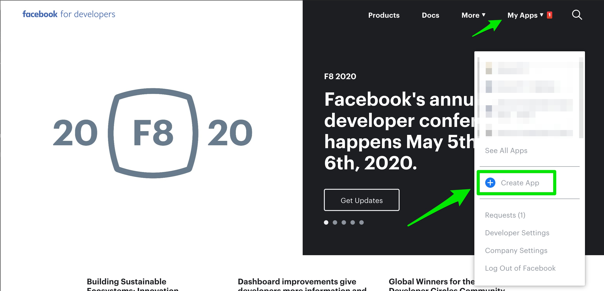

2. Give your app a **Display Name** and click **Create App ID**.
   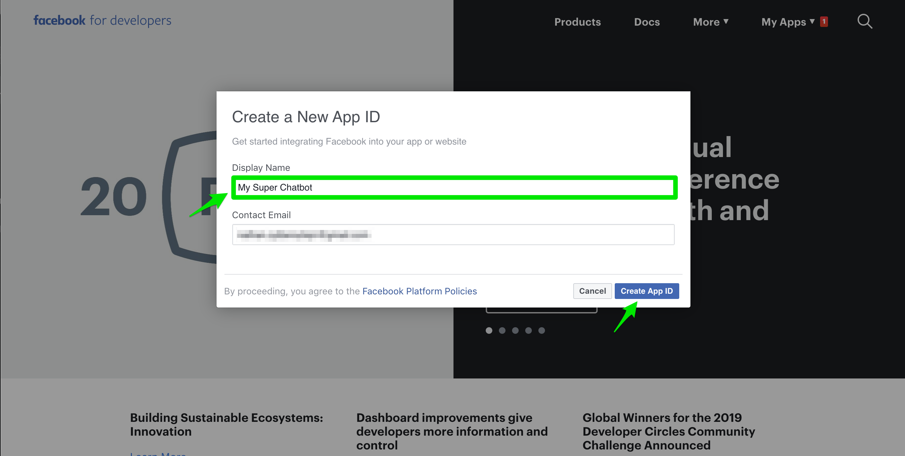

3. Look for the **Messenger Card** and click **Set Up**.
   

4. Scroll down a bit until you find the **Access Token** section and click on the **Add or Remove Page** button.
   

5. Confirm the identity you want to proceed with.
   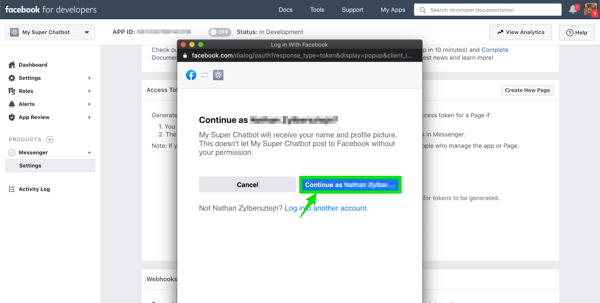

6. Facebook will show you the pages you are allowed to use. Select the page you want to attach your app to and click on **Next**.
   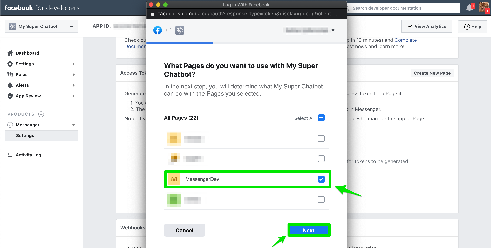

7. Just click **Done** and ignore the warning for now. When you deploy your bot you'll need the ask at least the `locale` permission. This permission is required by Botfront and you can justify it by the need to answer users in their language.

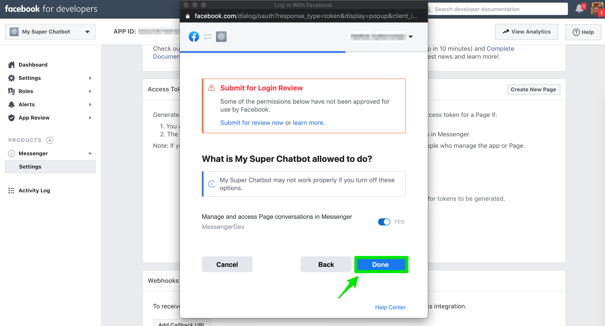

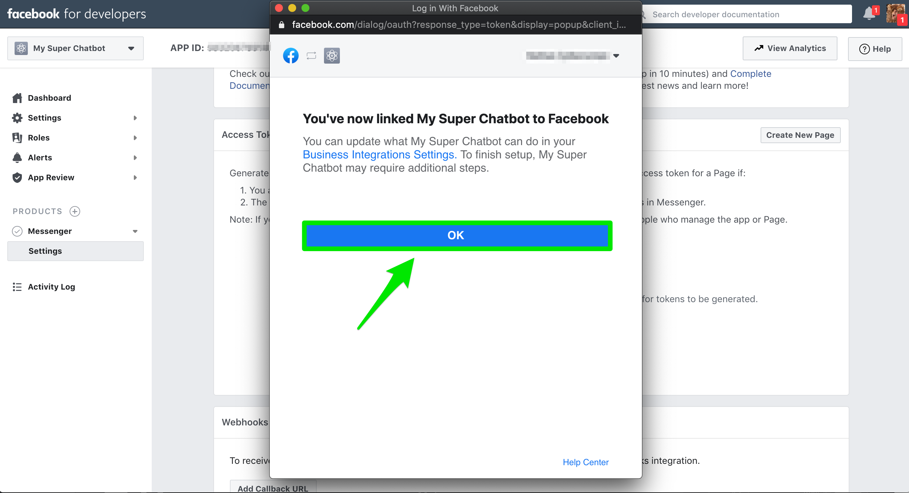

8. Click the **Generate Token** button
   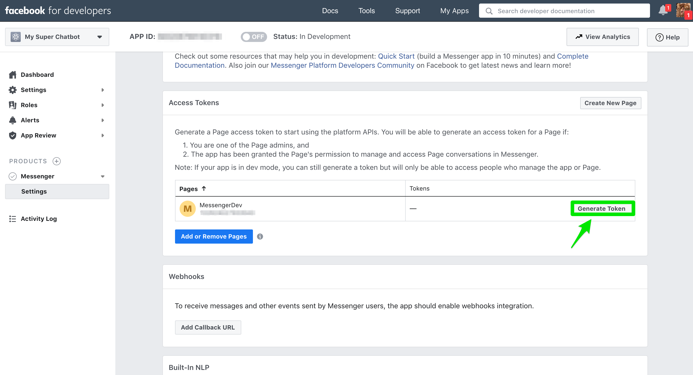

- Click on **I understand** to see th token. As noted, you will not be able to see this token again.
- Click on **Copy** and paste it direcly in the **channel** section and save it:

```yaml
rasa_addons.core.channels.facebook_messenger.FBMessengerInput:
  page-access-token: <your token>
  ...
```

9. Click on **Done**.
   

10. Click on **Settings** -> **Basic** in the left menu and click **show** in the App Secret. Copy the value to the **app_secret** field in your channel
    

```yaml
rasa_addons.core.channels.facebook_messenger.FBMessengerInput:
  page-access-token: <your token>
  secret: <your secret>
  ...
```

11. Add a verify token. It's a string of your choice, just pick something not too obvious.

```yaml
rasa_addons.core.channels.facebook_messenger.FBMessengerInput:
  page-access-token: <your token>
  secret: <your secret>
  verify: <your verify token>
```

## Local development

If you develop from your local machine, you need to create a tunnel to expose your local server to the internet so Facebook can redirect messages to your machine. The two main options are [localtunnel.me](https://localtunnel.me) and [ngrok.com](https://ngrok.com).

**Localtunnel** is open source, **Ngrok** is commercial but has a free plan that works for most cases. In our experience **Ngrok** is more reliable (the tunnel breaks often with LT) and has nice UI allowing request inspection and replay, which is very handy when debugging. We'll continue this tutorial with **Ngrok**.

#### 1. Setup Ngrok

[Sign up](https://dashboard.ngrok.com/signup) to a free Ngrok plan.

[Download and setup Ngrok](https://ngrok.com/download) on your machine.

The installation is not global, which means you'll need to invoke `ngrok` with the full path. To avoid that create a symlink (MacOS and Linux)

```bash
# cd into your local bin directory
cd /usr/local/bin
# create symlink to the installation path
ln -s /Applications/ngrok ngrok
```

To start **Ngrok**, run `ngrok http 5005`. `5005` is the port used by Rasa on your local machine.
You will see the following in your console:
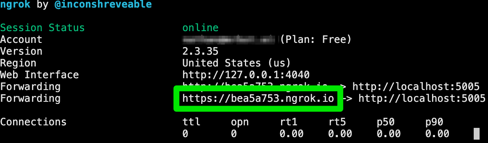

All requests sent to `https://bea5a753.ngrok.io` will be forwared to `https://localhost:5005` on your local machine. Now let's provide this information to Facebook.

#### 2. Setup your Webhook

In the App you created earlier, scroll down to the **Webhook** section and click on **Add Callback URL**.
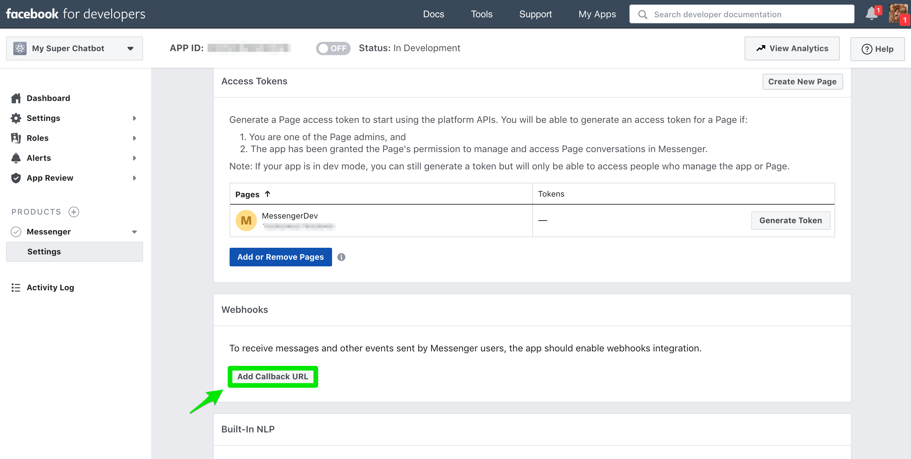

Provide your webhook URL (`https://<ngrok_host>/webhooks/facebook/webhook`) and the `verify` token you defined in the step `11.` above. Click on **Save**.


Subscribe to relevant events. You should probably have at least those shown in the screenshot, see the [official docs](https://developers.facebook.com/docs/messenger-platform/reference/webhook-events/) for more details.
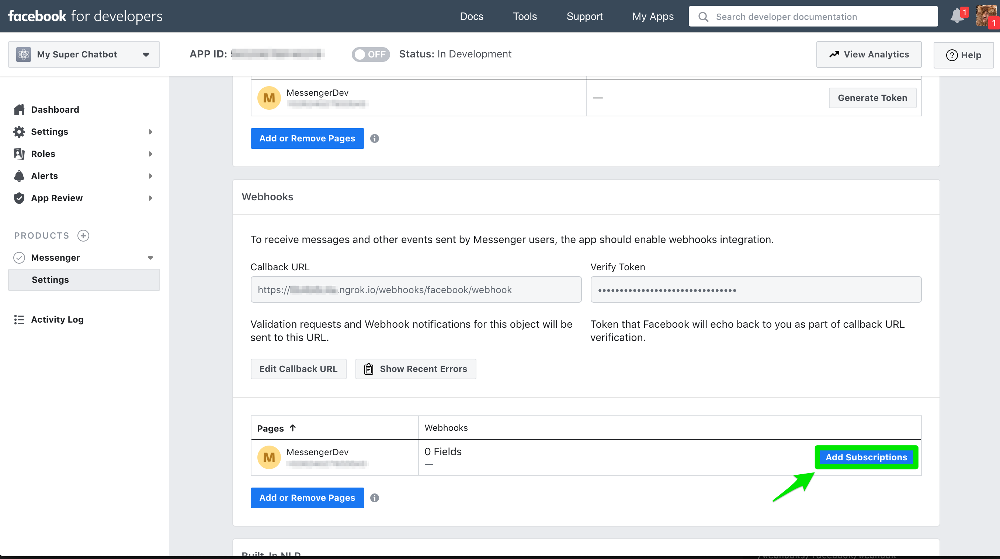

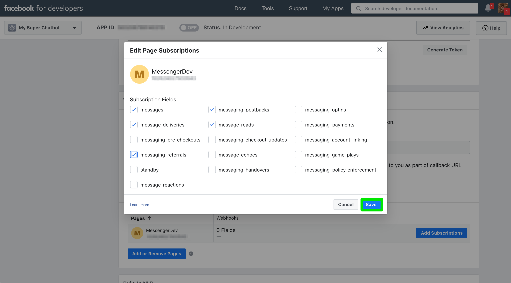

#### 3. Chat with your bot

Just head to `https://m.me/<page_id>` where the `<page_id>` can be found in your app settings (in the screenshot below it is blurred).
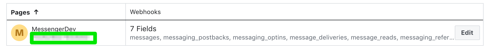
