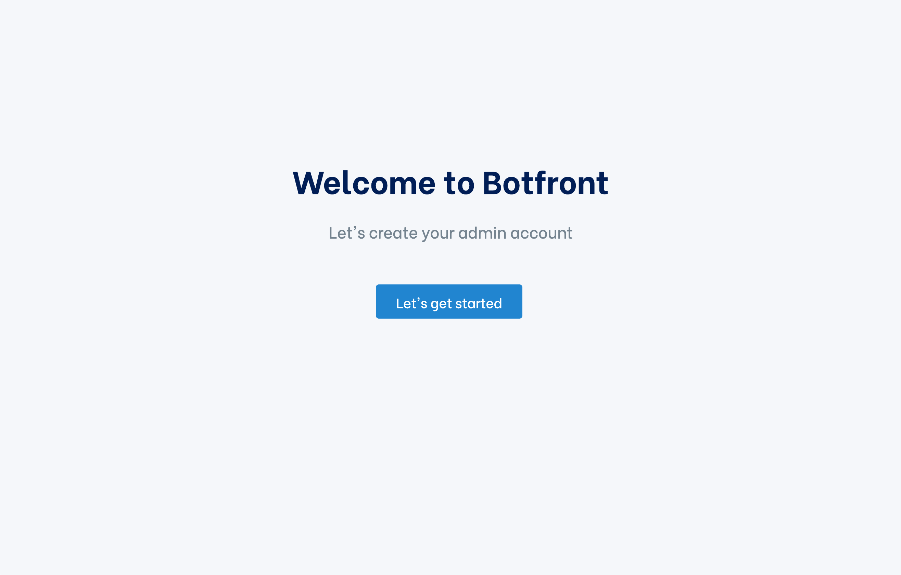
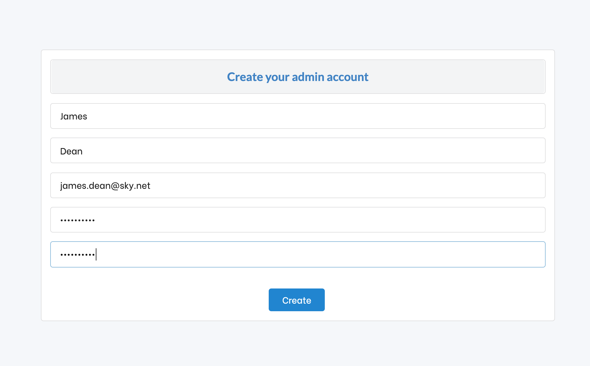
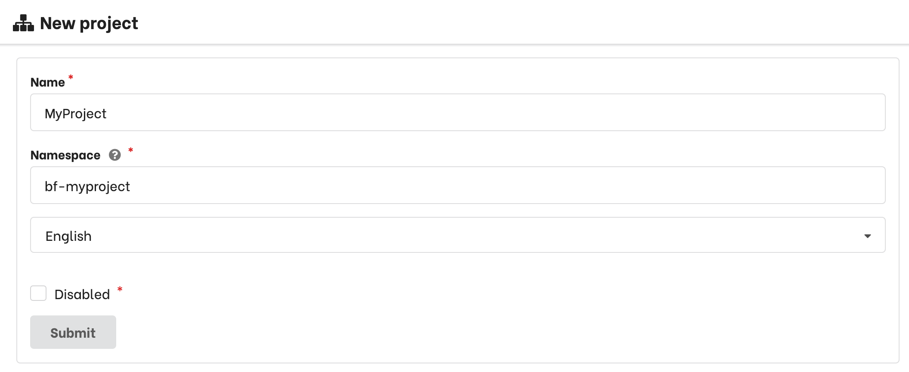
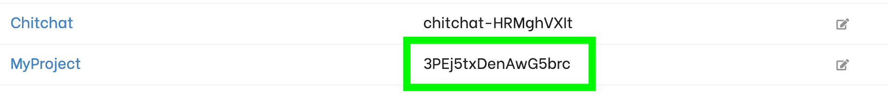
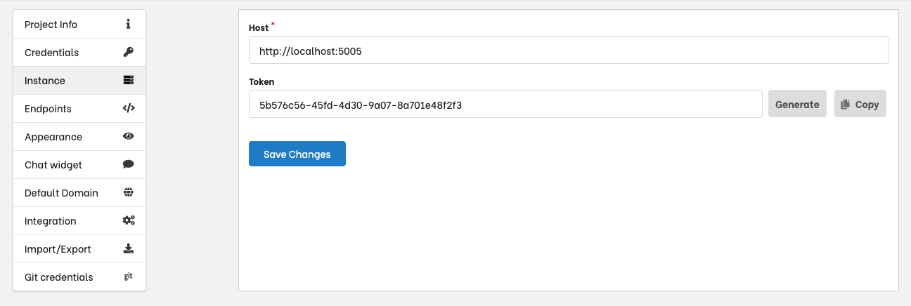
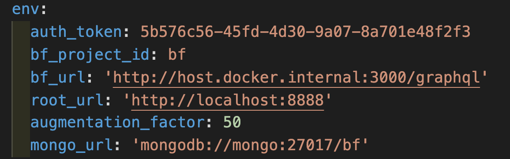

# Setup

<Important type="warning">
  Botfront is multi-project since Botfront 1.x. This feature is more useful on a hosted environment than on a local machine where it's more convenient to have one project per folder. Hence this process might seem a bit convoluted 
</Important>


## Requirements

Botfront has a few technical requirements. See them [here](/docs/deployment/configuration/#indicative-minimal-technical-requirements).

- Linux or macOS (Windows may work but is not officially supported yet, [help is welcome](https://github.com/botfront/botfront/issues/115))
- Chrome (some issues with other browsers)
- A recent version of Docker
- A recent version of Node.js

## Install the Botfront CLI

```bash
npm install -g botfront
```

## Create a new project folder


```bash
botfront init
```

Botfront will prompt you for a folder name if the current directory is not empty

## Start Botfront

```bash
botfront up
```

Botfront will download Docker images and then start. Botfront will open in your browser.



## Create your admin account

Just fill the usual details and save.



## Create your project

> **Do NOT use the chitchat project**

Above the project list click **Add project**


And enter project details. Namespace doesn't matter in local installations, and submit



## Connect Rasa to your new project

Copy your project id



Then, in your terminal (from the project folder):

```bash
botfront set-project 3PEj5txDenAwG5brc # or whatever your project ID is
```
 
Congrats! Your project is now ready!


## Secure rasa access (optional)

You might want to secure the communication between botfront and rasa-for-botfront.

- In the instance settings there is a token, you can edit it or generate new ones as you feel.


- Add this token in env part of the botfront.yml under the key auth_token


- restart botfront (`botfront down` and then `botfront up`)

The rasa api is now protected !
