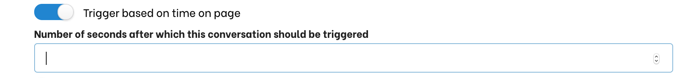
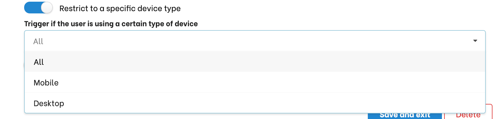
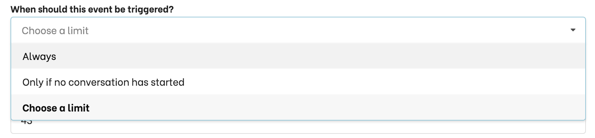
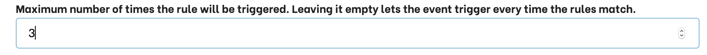
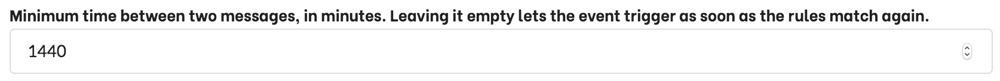

# Advanced

## Other conditions

### Time on page

The conversation will be triggered after a user has stayed more than the specified number of seconds on a page. This is generally used in combination with [browsing history](#trigger-story-based-on-browsing-history)

### Device type

Use this to start a given conversation only on a computer or mobile device.

## Settings limits

You can limit the number of times a trigger will be executed if the conditions are met.

- **Always:** the story will be triggered each time the condition set in this trigger are met.
When set, thd conversation will be triggered each time the conditions are met for a given user.
- **Only if no conversation has started:** the story will be triggered only if the conversation history is empty.
- **Choose a limit:** The story will be triggered each time the condition set in this trigger is met, but only for the number of times set.

<Important type="info" title="The behavior is stored in the browser's local storage">
The behaviour information is stored in the browser. If their local storage is cleared the triggers will not be executed as expected.
</Important>

### Minimum interval

Suppose you want to engage with a user the second times they come on a given page. But you don't want to waste it if the user refreshes the page or just comes back seconds later.

In the above example, we made sure the trigger would only be activated if24 hours (1440 minutes) occur between the two visits.

## Combining conditions

You can create complex combinations of conditions triggering a conversation. Generally you want different type of combinations:

### Start a conversations when ALL conditions are met (`AND`).

This is the default behaviour when you set a trigger. If you specify multiple rules, the trigger will only be effective when ALL conditions are met.
In the following example, the conversation will only start if the user is visiting a URL matching **products** for the second (or more) time and stays at least 3 seconds on the page.

### Start a conversation when ANY condition is met (`OR`).
If you add several triggers, the conversation will start when the conditions set for any triggers are met.
In the following example, the conversation will start either if a user hits a URL matching **products** or if they stay on any page for more than 2 seconds.

