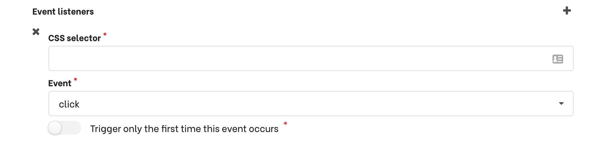

<Important type="info">
Proactive conversations are only available on your website with the Botfront chat widget.
</Important>

# Engage with users landing from a campaign

**Use case 1**: a company runs a Google Ads campaign and wants to engage with visitors coming from that campaign on a landing page.

We can trigger a conversation based the **utm** tags expected in the url:
<video autoplay muted loop width="100%" controls>
  <source src="../../videos/triggers_ad_campaign.m4v" type="video/mp4"/>
  Your browser does not support the video tag.
</video>
When a user clicks on the ad, they will be asked to sign up.
  

**Use case 2**: a company runs an email campaign. When a subscriber clicks on the link and lands on the landing page, the virtual assistant greets them by their firts name.

Let's assume the first name is merged in the email. The link points to a url such as:
`http://yoursite.com/landing?first_name=James`

Let's create the trigger:
<video autoplay muted loop width="100%" controls>
  <source src="../../videos/triggers_email_campaign.m4v" type="video/mp4"/>
  Your browser does not support the video tag.
</video>

Let's go into more details:

1. We enable **Trigger if specific query string parameters are present in the URL**
2. We set the parameter name `first_name`. But we don't know its value in advance (like we did with the `utm_source` in use case 1). That's why we enable the option to send the parameter as an entity.
3. To use the first name in the conversation, we need to save the entity value in a slot that has the same name. Since this slot does not exist, we create it.
4. Finally, we can access the first name just by using `{first_name}` in the response.

## Engage with a users performing an action

This allows you to trigger a conversation when a user clicks somewhere, when they enter or exit a form element, etc.
Simply specify the javascript event you want to listen to and the corresponding CSS selector.
