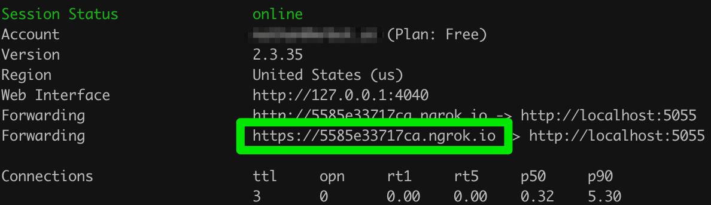
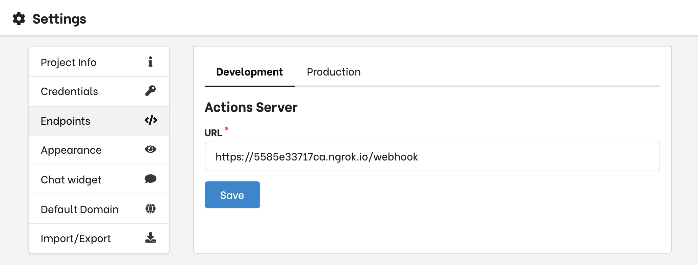

# Create Rasa custom actions

Custom actions are used for all actions that cannot be handled in the visual story editor and require custom code.
You can use them for API calls, calculations, etc.

Since Botfront uses Rasa, custom actions in Botfront and Rasa are the same.

A custom action is a Python class:

```python
class FetchStatus(Action):

    def name(self):
        return 'action_fetch_status'

    def run(self, dispatcher, tracker, domain):
        url = "https://some.api.com/user/xxx/status"
        status = requests.get(url).json
        return [SlotSet("status", status)]
```

The `run` method performs an arbitrary action and returns an array of [Events](https://rasa.com/docs/rasa/api/events/), generally `SlotSet` events.
The action above assigns the fetched status to the slot _status_. The slot can then be used in the conversation.

The action can be invoked from the conversation builder:
<video autoplay muted loop width="100%" controls>
  <source src="../../videos/custom_actions_builder.m4v" type="video/mp4"/>
  Your browser does not support the video tag.
</video>

In the `run` method you can access the conversation state and utter responses. Those are the most commonly used methods, see the [Rasa SDK documentation](https://rasa.com/docs/rasa/api/rasa-sdk/) for more.
- `tracker.get_slot(slot_name)`: get the value of a slot
- `tracker.latest_message`: retrieve the latest message sent by a user. The `latest_message` contains the whole payload, including the intent and entities.
- `dispatcher.utter_message(template="utter_whatever")`: utter a bot response


## Using Custom actions

Whether you're a Botfront Open Source user or a Botfront Cloud customer creating custom actions is super easy.
As explained below, you can spin up an action server in no time with the CLI and your code will be hot reloading so you can see the impact of your changes live.

### In Botfront Cloud

#### Development

To develop your actions, the easiest is to run an action server locally and tunnel Botfront.

To start an action server locally:

1. Install the Botfront CLI:
```
npm install -g botfront
```

2. Create an action projects:
```
botfront init --cloud
```

3. `cd` the project folder and launch the action server
```
botfront up
```

4. Watch for file changes
```
botfront watch
```

Any change in the `actions` folder will rebuild and restart the actions server.


When you save an action, you can verify that it's loaded in the logs by looking for this line:
```
INFO:rasa_sdk.executor:Registered function for 'action_fetch_status'.
```

5. In a different terminal (same location) you can follow the logs:
```
botfront logs
```

You can create your actions in the `actions` folder.
You can add actions to the default `my_actions.py` file or add new files.
You can use the `Dockerfile` to install Python dependencies.

The last thing you need to do is to create a tunnel to get your Rasa instance on Botfront Cloud call your local actions server. You can use **Ngrok** for that.

[Sign up](https://dashboard.ngrok.com/signup) to a free Ngrok plan.

[Download and setup Ngrok](https://ngrok.com/download) on your machine.

The installation is not global, which means you'll need to invoke `ngrok` with the full path. To avoid that create a symlink (MacOS and Linux)

```bash
# cd into your local bin directory
cd /usr/local/bin
# create symlink to the installation path
ln -s /Applications/ngrok ngrok
```

To start **Ngrok**, run `ngrok http 5055`. `5055` is the port used by the actions server on your local machine.

You will see the following in your console:


Copy the forward URL and past it in Settings -> Endpoints. **Don't forget the `/webhook` route**


<Important type="tip" title="Importing modules in your actions">

Your imports must include `actions`. If you want to import a module in the `actions` folder:

```python
import actions.my_module
```

</Important>

#### Production

Contact us if you want us to host your production actions deployment.

### Botfront Open Source

When initializing a project with `botfront init` an _actions_ folder is created and the action server is automatically launched with `botfront up`.
You can use `botfront watch` to rebuild and restart your actions server as above.

#### Deployment

You can build your action server Docker image with the `Dockerfile.production` in the `actions` folder of your project.
