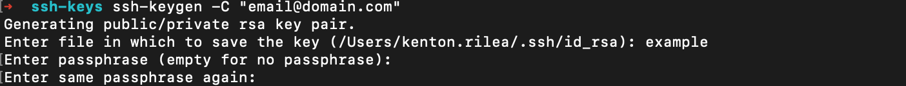
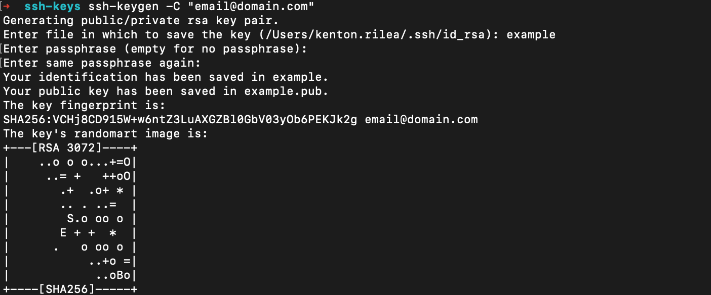
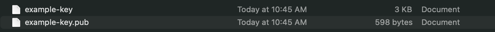
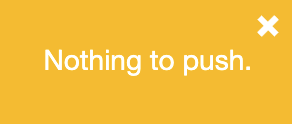
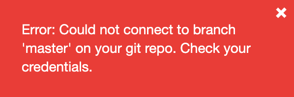

# Overview	

Versioning in Botfront is handled by git.
Each project can be connected to a branch of a git repository enabling you to push your changes and revert to previous versions.

# Setup

The two components required to connect to a git repository are the connection string and authentication.
There are many authentication methods for git, but we highly recommend using a SSH key as it typically allows for a finer level of access control.
It is also highly recommended that you limit the access of this key to the minimum permissions required to pull and push to the branch you are using for your project.

Note that SSH keys stored in Botfront are not encrypted and are visible to any user with the git-credentials:r permission in your project scope.

## Creating a SSH key

To create a SSH key for linux/macOS open a terminal window on your computer and enter the command ```ssh-keygen -C "Comment"```.
The -C command allows you to add a comment that will help to keep track of your keys.

When prompted type a file name and Press Enter.


Next, Enter and re-Enter a passphrase.




Your key will then be created. the full terminal output should look similar to the following.




in the directory where you created your keys, there will be two new files: key-name and key-name.pub. The first file contains the private key and the second the public key.




## Adding a SSH key to a Github repository

Open the git repository in Github.

Go to **Settings** -> **Deploy keys**.

Click on **Add deploy key**.

Enter a title and copy the public key from the .pub file into the **Key** text-box.

Make sure the **Allow write access** checkbox is checked so the Botfront will be able to push.

Click **Save** to add this key to your repo.

<video autoplay muted loop width="100%" controls>
  <source src="../../videos/git_integration/add_ssh_key_github.m4v" type="video/mp4"/>
  Your browser does not support the video tag.
</video>

You should now be able to see a new key with the title you chose listed under the **Deploy keys** header.

## Connecting Botfront to git

Open your project in Botfront and navigate to **Settings** -> **Git credentials.**

Copy your git connection string into the git repository field followed by ```#<branch-name>``` where ```<branch-name>``` is the name of an existing branch in your repo that Botfront will use to store the current project.

A SSH key is made up of two files, one with a public key and one with a private key. Copy the text from the .pub file into the public field and the text from the other file into the private field.

Click on Save to save your credentials.

To confirm that you are connected to git, navigate back to the stories screen and verify that the git button is visible in the top bar.

<video autoplay muted loop width="100%" controls>
  <source src="../../videos/git_integration/setup_git_credentials.m4v" type="video/mp4"/>
  Your browser does not support the video tag.
</video>


Note that git button will be disabled if your project is unable to connect to a Rasa instance as the conversion of imported and exported files relies on Rasa.

# Using git integration

Once your project is connected to a git repository the git button will appear in the main top bar.
Click on this button to open a dropdown with two actions; Commit and push, and Revert to previous.

## Commit and push

To save your changes to the connected repo click on the **Commit and push** option in the git button dropdown.
In the Modal that opens enter a commit message that describes the changes you have made to the project then click **Push to remote** to save your changes.

<video autoplay muted loop width="100%" controls>
  <source src="../../videos/git_integration/commit_changes.m4v" type="video/mp4"/>
  Your browser does not support the video tag.
</video>

If your changes were successfully saved a green alert will appear in the top right of your screen.


If there have been no changes since you last committed a yellow alert will appear in the top right corner of your screen.



If Botfront is unable to commit and push a red alert containing an error message will appear in the top right corner of your screen.



## Revert to previous

To revert to a previous version of your project click on the **Revert to previous** option in the git button dropdown.
In the modal that opens find the commit that you would like to revert to, hover your mouse over the row, and then click on the **Revert** button that appears.

<video autoplay muted loop width="100%" controls>
  <source src="../../videos/git_integration/revert_to_previous.m4v" type="video/mp4"/>
  Your browser does not support the video tag.
</video>

If your project contains any unsaved changes it will save them with the commit message```Project state before revert to <commitId>``` before reverting to the selected commit.