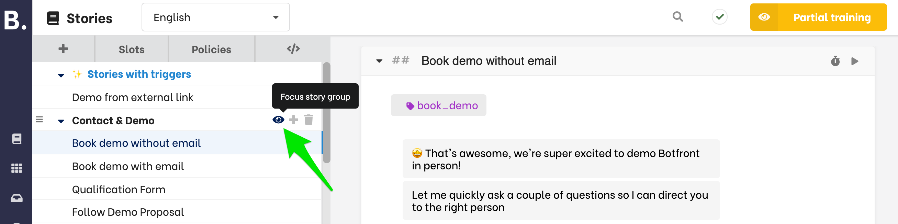

# Getting started

Botfront is a fully featured conversational platform with intuitive interfaces to create context-aware virtual assistants.

Botfront is deeply integrated with [Rasa](https://github.com/rasaHQ/rasa).
If you are already familiar with Rasa, the conversation builder will let you focus on conversation authoring and handle markdown and yaml files for you.

This integration allows Botfront to offer advanced Natural Language Understanding capabilities in any language and context driven dialogue management.

## Your first dialogue

Similarly to human-to-human interactions, human-to-machine interactions are based on dialogue turns.
A turn consists in a **user input** followed by a **virtual assistant response**.

In Botfront, you can design automated conversations in fragments called [**stories**](https://rasa.com/docs/rasa/stories) and [**rules**](https://rasa.com/docs/rasa/rules).
The links point to the official Rasa documentation that explains the difference in greater details, but in short, rules are for very simple interactions not requiring AI, 
such as FAQ, basic chitchat, and launching a form, and stories are for conversational experiences when you expect AI to complement the cases you provide in your data.
For logical flows with complex conditional logic, you can use forms (and rules or stories to orchestrate them)  

Let's start with a simple example, A user greets the virtual assistant and the bot answers.

<video autoplay muted loop width="100%" controls>
  <source src="../../../videos/conversation_quickstart1.m4v" type="video/mp4"/>
  Your browser does not support the video tag.
</video>

Let's have a closer look to what happened in that video:

1. We created a new story and give it the name _Greetings_. This name is for reference only.
2. We defined Start the story with a user utterance (_Hello_)
3. We annotated the utterance with the intent `greet`.
4. We set the response given by the assistant.

> You cannot edit a user utterance after you save it. If you want to change something, you will need to delete it and add a new one in the same place.

When you save a user utterance, it is also added to your training data to easily develop and enhance your model. If you delete it in the conversation builder, it will still remain in your training data. If you completely want to remove a user utterance from everywhere, you will need to manually delete it from your training data as well.

<Important type="info">
Rules might be a better fit for these simple conversations as they will take less time to train. 
</Important>

## Improving Natural Language Understanding

We can't expect a user to always greet with _Hello_.
There are many ways to greet and we want our virtual assistant to understand as many as possible.

We need to teach our assistant many ways of greeting:
our story isn't just about replying to someone saying _Hello_, it is about replying to all users greeting your AI assistant.

Click on the user utterance and add your examples as shown below:

<video autoplay muted loop width="740" controls>
  <source src="../../../videos/conversation_quickstart2.m4v" type="video/mp4"/>
  Your browser does not support the video tag.
</video>

<Important title='How many examples should I add?'>
A good starting point is 10-15 examples per intent.
You can always add more examples later, either from here or from the incoming section
to use examples from real conversations.
</Important>

**An assistant needs at least two intents.** Let's add a second story with farewells:

<video autoplay muted loop width="740" controls>
  <source src="../../../videos/conversation_quickstart3.m4v" type="video/mp4"/>
  Your browser does not support the video tag.
</video>

## Training your assistant

You can now train your bot and talk start chatting.
<video autoplay muted loop width="740" controls>
  <source src="../../../videos/conversation_quickstart4.m4v" type="video/mp4"/>
  Your browser does not support the video tag.
</video>

import { FaEye } from "react-icons/fa";

<Important type="info" title="Partial training">

Depending on your policies and the number of stories, training can take a significant amount of time.
To help you iterate faster on subsets of your dialogues, you can focus on one or several story groups and train just the stories they contain.

You may click on the  <FaEye size='0.8rem'/>  icon which appears when you hover story group names. When a story group has focus enabled, training will be restricted to the stories of those groups.

</Important>

## Handling different conversation paths with branches

Conversations can take different paths. Let's continue our greetings conversation.
But instead of just greeting the user back, let's ask how they feel and handle positive and negative answers.

We'll use branches to handle the different scenarios, (feeling good vs. feeling bad), as shown in the following video:

<video autoplay muted loop width="100%" controls>
  <source src="../../../videos/conversation_quickstart5.m4v" type="video/mp4"/>
  Your browser does not support the video tag.
</video>

A few things to keep in mind when using branches:
- Branches must always started with user utterances, (or as we'll se later with slots directives) but never with bot responses.
- You can set names to branches (in the video we left the default names _New branch_X). The name is only for your reference doesn't impact the flow of your conversation.

## Adding buttons to your responses

Botfront comes with different response types.
In the examples above we used text responses, but in many cases you want to offer easy options to users.

In the example above, we could provide two buttons _Feel great_ and _Feel bad_.

<video autoplay muted loop width="740" controls>
  <source src="../../../videos/conversation_quickstart6.m4v" type="video/mp4"/>
  Your browser does not support the video tag.
</video>

<Important title='Understanding payloads'>
Remember that a conversation is made of turns and a turn is a <strong>user input</strong> followed by an <strong>assistant response</strong>.
When we say <i>I feel great</i>, the first step is extract the intent: <strong>feel_good</strong>.
The the dialogue engine uses the intent to determine the appropriate response.

When a user clicks a button, it is the equivalent of saying something, except we can skip the natural language understanding step.

The payload is just the underlying intent <strong>feel_good</strong>.
</Important>

## Handling feedback and other converging flows with links

A common flow consists in asking a user if they are satisfied with a response or a process.
You can use the links feature for that as follows:

1. Create a new story called, for example, _Feedback_
2. This story should start with a bot response, as the bot will follow-up with it after handling another user request.
3. Link other stories to the new _Feedback_ story from the footer menu.

The following video shows an example:

<video autoplay muted loop width="740" controls>
  <source src="../../../videos/conversation_quickstart7.m4v" type="video/mp4"/>
  Your browser does not support the video tag.
</video>

> **Note about branches and links**
>
> Botfront uses [Rasa checkpoints](https://rasa.com/docs/rasa/core/stories/#checkpoints) to accommodate branching and linking.
> When you export your project to Rasa X or Rasa Open Source, checkpoints will be generated in the exported stories.
> If you re-import those stories without changing the checkpoint names, Botfront will rebuild branches and links.

