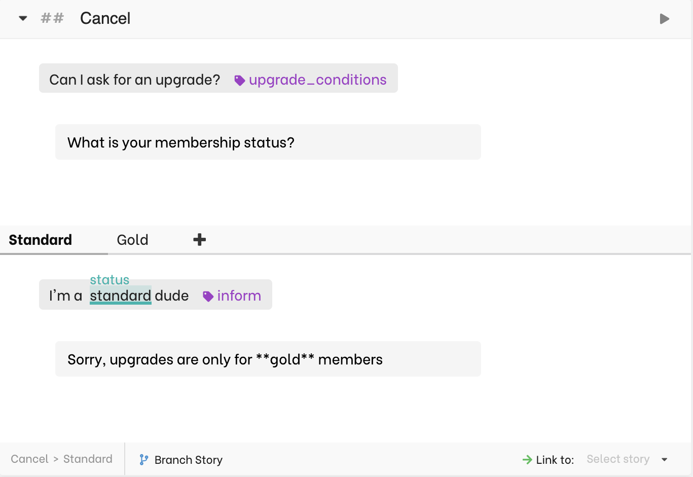

# Conversation context

The best way to understand context is to think about how we, humans, handle it.
When we respond to someone else's _utterance_, we respond considering the history we have with that person.
We remember facts, about the other person, but also the previous turns of the conversation.

## Remembering previous turns

If you say _Hi_ three times in a row to someone, the third response might be different from the first one.

The following video shows how to replicate this with your assistant.

<video autoplay muted loop width="100%" controls>
  <source src="../../../videos/conversation_quickstart8.m4v" type="video/mp4"/>
  Your browser does not support the video tag.
</video>

When predicting a response to **chitchat.greet**, Rasa will consider the whole story, not just the latest user message.
Therefore you can re-use the same intent several times in a row and give different responses.

# Using slots to remember facts

Slots are containers you can create to store information in the conversation's context.
Slots comes in different types. **Unfeaturized** slots can be used only to store information,
while other types of slots can also influence the course of the conversation.


## Storing information in slots

Information can be stored in slots in different ways:

### From entities

To store the value of an entity in a slots, you simply need to create a slot with the same name.
In the example below, **color**:
<video autoplay muted loop width='100%' controls>
    <source
        src='../../../videos/conversation_quickstart11.m4v'
        type='video/mp4'
    />
    Your browser does not support the video tag.
</video>

The slot **color** is automatically paired with the entity **color**. Which means that every time an entity **color** is detected in the course of a conversation, its value will be stored (and overwritten) in the slot **color**.

### From custom actions

You can set a slot from a custom action:

```python
class SetColor(Action):

    def name(self):
        return 'action_set_color'

    def run(self, dispatcher, tracker, domain):
        return [SlotSet("color","blue")]
```


### Accessing slot values in responses

You can now re-use the slot value in a response by putting the slot name between curly braces, for example `{color}`:

<video autoplay muted loop width='100%' controls>
    <source
        src='../../../videos/conversation_quickstart12.m4v'
        type='video/mp4'
    />
    Your browser does not support the video tag.
</video>

## Slot types

### Categorical slots

In the following example, a user asks for a cancellation but only a **gold** member can cancel.
Depending on the status the user declares, the conversation will follow one of the branches.
The status is declared with entities, but for the branching to work a slot must be declared, **as shown at the end of the video below**:

<video autoplay muted loop width="100%" controls>
  <source src="../../../videos/categorical_slots_entities.mp4" type="video/mp4"/>
  Your browser does not support the video tag.
</video>

<Important type="info" title="Since it's is about context">
he combination of intent and entities <strong>inform</strong> and <strong>status</strong> can be re-used in other contexts:{' '}
Users could have to declare their status in many different contexts.<br />
If you were to write a story to answer users asking the conditions required for an upgrade, you can re-use the exact same intent and entities when listening to a user declaring a status:



</Important>

#### Setting slots from custom actions

Since we are able to cancel a stay, we are probably able to check the status with a custom action like the following:

```python
class FetchStatus(Action):

    def name(self):
        return 'action_fetch_status'

    def run(self, dispatcher, tracker, domain):
        status = ... # a function that will get the user status from your api
        return [SlotSet("status", status)]
```

Then we can invoke this action in our dialogue.
Note that this time, since the user doesn't have to declare their status anymore, we won't use user utterances to branch, but slots, as shown in the following video:

<video autoplay muted loop width="100%" controls>
  <source src="../../../videos/categorical_slots_entities2.mp4" type="video/mp4"/>
  Your browser does not support the video tag.
</video>


### Boolean slots

Boolean slots can be seen as a particular case of categorical slots: they can only be `true` or `false`.
The following example verifies that a user is logged in before checking their current balance:

<video autoplay muted loop width="100%" controls>
  <source src="../../../videos/boolean_slots.mp4" type="video/mp4"/>
  Your browser does not support the video tag.
</video>

This story could be backed by the following custom actions:

```python
class IsLoggedIn(Action):

    def name(self):
        return 'action_is_logged_in'

    def run(self, dispatcher, tracker, domain):
        logged_in = ... # something boolean
        return [SlotSet("logged_in", logged_in)] # logged_in is either True or False

class CheckBalance(Action):

    def name(self):
        return 'action_check_balance'

    def run(self, dispatcher, tracker, domain):
        balance = ... # a function that checks the current balance
        return [SlotSet("balance", logged_in)] # logged_in is either True or False
```

> **Note**:
>
> An unfeaturized slot **balance** should also be created (not shown in the video)

### List slots

List slots are useful for search results. Consider the following example:

<video autoplay muted loop width="100%" controls>
  <source src="../../../videos/list_slots.mp4" type="video/mp4"/>
  Your browser does not support the video tag.
</video>

This story could be backed by the following custom actions:

```python
class SearchProducts(Action):

    def name(self):
        return 'action_search_products'

    def run(self, dispatcher, tracker, domain):
        products = ... # something returning a list of results, possible null or empty
        return [SlotSet("results", products)] # logged_in is either True or False

class ShowResults(Action):

    def name(self):
        return 'action_show_results'

    def run(self, dispatcher, tracker, domain):
        results = tracker.get_slot("results")
        dispatcher.utter_message(...)
        return []
```

**Note**: we could also have used a simpler story without branches and let the action display either the results or a _no results_ message:
```python
class SearchProducts(Action):
    def name(self):
        return 'action_search_products'

    def run(self, dispatcher, tracker, domain):
        products = ... # something returning a list of results, possible null or empty
        if products and len(products) > 0:
            dispatcher.utter_message(...)
        else:
            dispatcher.utter_template("utter_no_results")
```

This will work, however we recommend writing custom actions as specialized and atomic as possible and leave most of the conversation flow design in the editor.

### Unfeaturized slots

Unfeaturized are slots that are only used to store information. They cannot be used to branch conversations.


### For more information on slots

If you need to dig further, we recommend reading the [Slots section in the Rasa documentation](https://rasa.com/docs/rasa/core/slots/).


