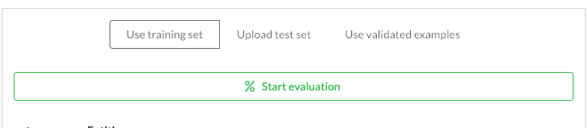
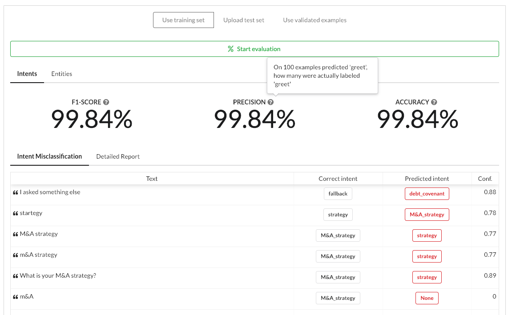
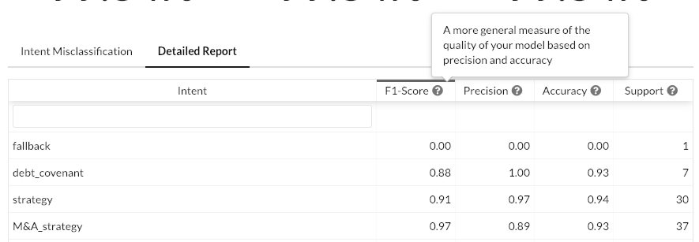

# Evaluation

Evaluation gives you aggregate metrics and actionable feedback on your NLU model.

## Evaluation methods

It is generally advised to keep a portion of your data aside for evaluation purposes when training a machine learning model. However, few people do it for NLU models:

1. The benefits of an independent evaluation set do not always exceed the cost of a lower performing model because of a lack of training data.
2. The evaluation set needs to be maintained as the nature of data changes when the chatbot meets real users with different ways of expressing things.

Botfront offers several options to evaluate your model and avoids tradeoffs mentioned above.

### Using training data

Although the metrics from such an evaluation are usually overestimated and unreliable, this evaluation method is very useful during development as it allows you to quickly pinpoint model design issues or data annotation errors.

### Using validated data

You can use validated examples to evaluate your models’ performances as soon as your bot meets users, even testers. Those are valid evaluation data points because your model has never seen them, and they are of good quality because you just validated them. They are also unbiased because they come from recent conversations with real users. Finally, once the evaluation has been done, this data can be incorporated to your training data, so you’re not facing the dilemma of depriving your training data for the sake of evaluation. This is also very easy to do as there is no need to move data around, and it lets you track the evolution of your model’s performance over time.

### Using a separate test set (upload)

The standard way to evaluate, but also the least used for the reasons explained above.

<Important type="tip" title="Use this method to evaluate your entities">

Suppose you want to teach your model to extract Canadian cities as entities. You won't (you shouldn't) have examples for all the possible cities. How can you make sure your model will pick them up? Generate a dataset containing each of them with a tool such as [Chatito](https://rodrigopivi.github.io/Chatito/) and use that as an uploadable test set. You'll quickly find out which cities are missed.

</Important>

<Important type="warning">

Do not generate your **training dataset** this way! You'll end up with a huge dataset lacking semantic variety.

</Important>

## Evaluation reports

### Intents

General metrics and actionable feedback on intents. You can see at a glance how your model performs and where it fails: all failing utterances are listed alongside their actual vs. predicted intent. The example above shows that errors are likely due to mislabelling or conflicting intents (a very common issue in datasets growing in size).

The view below replaces the usual confusion matrix which we decided to discard because of its impractical use for big NLU models. A 50x50 matrix for 50 intents is very hard to read on a screen and doesn’t convey any insight on actions to perform to fix problems.

A detailed per intent report is also available in the form of a sortable table where you can see which intents are the weakest and require priority actions.

### Entities

Entity extraction is tricky to evaluate and debug. The report shows actionable feedback in the form of failed examples where the expected and actual outputs are compared. With a bit of practice you can quickly understand which problems are solvable and find solutions.
Similarly, you can see all the prediction errors.

