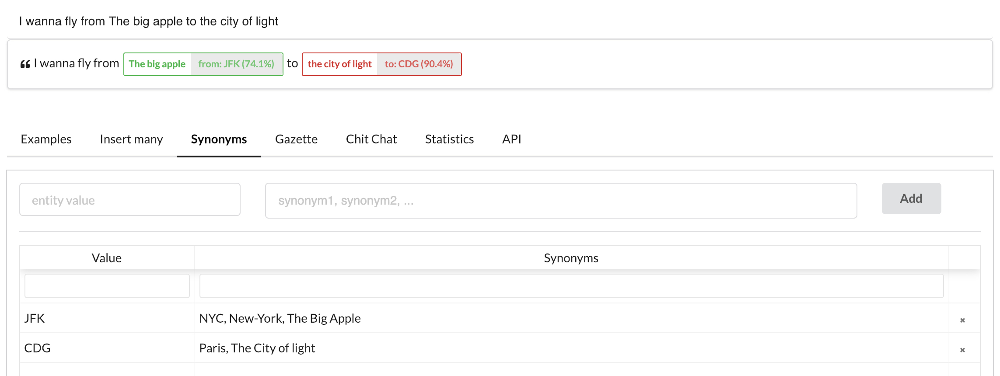
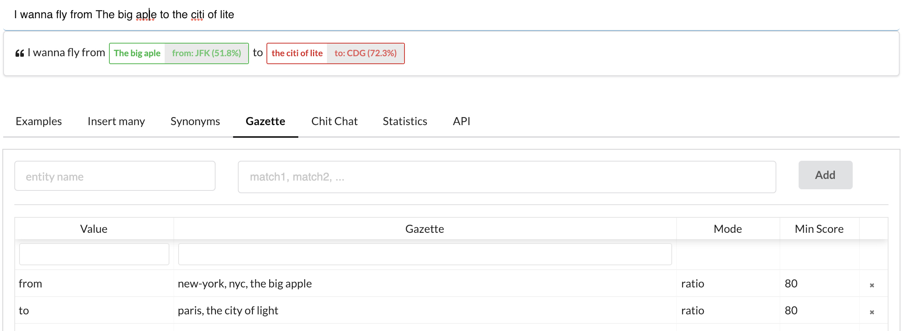

# Intents and entities

Technology plays a major role, but the most significant performance gains are obtained by developing a good understanding of the fundamental NLU concepts.

## Intents

An intent captures the general meaning of a sentence (or an utterance in the chatbots lingo). For example, the sentences below convey the intent of being hungry, let's call it `i_am_hungry`:

- I am hungry
- I need to eat something
- I am starving
- My kingdom for a pizza

How do we teach our model that these utterances convey the `i_am_hungry` intent? We train it to distinguish them from sentences with other meanings. We create a _dataset_ containing examples of different intents.

How can a program understand the meaning?
Let's just say that there's a way to express the meaning of words with numbers (or vectors).
The long explanation is [here](https://botfront.io/b/blog/how-intent-classification-works-in-nlu) if you're interested, but the essential idea is that vectors can be compared (a distance can be calculated), and that a small distance indicates the words have similar meaning.

When you click the **Train** button, Rasa, the conversational AI framework used by Botfront, will learn vectors from your examples, and learn how to distinguish intents.


## Entities

If an intent carries the general meaning of a user utterance, sometimes you need additional information.
Consider the following utterances:

- _I want to buy a **blue** shirt_
- _I want to buy a **red** short_

In both cases, the intent is to buy something.
The color is a useful information, but we don't want to have a different intent for each color.

The color is an additional information to extract and that's a perfect candidate for an entity
Entities are elements you want to extract from a user utterance.

## Trainable entities

In most cases you must teach your assistant how and where to find entities in your utterances.
You can do this by tagging entities in the user utterances you provide as examples.

In the example below, a user wants to buy a shirt and want to specify a color:

<video autoplay muted loop width='100%' controls>
    <source
        src='../../../videos/conversation_quickstart9.m4v'
        type='video/mp4'
    />
    Your browser does not support the video tag.
</video>

Again, to boost the accuracy of your assistant, you want to add several examples of utterances with that entities.

<video autoplay muted loop width='100%' controls>
    <source
        src='../../../videos/conversation_quickstart10.m4v'
        type='video/mp4'
    />
    Your browser does not support the video tag.
</video>

The goal here is to give examples with enough variety so you model can learn to generalize to utterances not in your training data.
In other words, you want to add enough data so your assistant starts to understand sentences it has never seen before.

For intents, it is about using a variety of words, and not just repeating the same sentence with a color variation.

For entities, it is about teaching your assistant how to retrieve it in different sentences. From your examples, your model should understand:

-   The content of your entities: give several colors (not necessarily all possible colors but enough to observe that it starts picking up colors it hasn't seen before)
-   The words before and after the entity.

> Keep in mind that the entity is not tied to an intent. You might use the same **color** entity with another intent.

## Extracting number, dates and other structured entities

Botfront integrates Rasa, which integrates [Duckling](https://github.com/facebook/duckling), an open source structured entity extractor developed by Facebook.
You must enable it in your NLU pipeline.
Here is an example of duckling configuration:

### Duckling extractor configuration

```yaml
- name: DucklingHTTPExtractor
  # Specify a URL if using Botfront open source or enterprise edition.
  # Botfront Cloud users must not specify a URL
  # url: http://duckling:8000
  locale: en_US
  dimensions:
    - number
    - date
    - amount-of-money
```

You need to set this configuration in your NLU pipeline, as shown in the following video:

<video autoplay muted loop width='100%' controls>
    <source
        src='../../../videos/conversation_quickstart14.m4v'
        type='video/mp4'
    />
    Your browser does not support the video tag.
</video>

<Important type="danger" title="Indentation errors can result in failures">
    Make sure to check the indentation before saving.
</Important>

A few things to keep in mind:

- **Botfront Cloud users do not need to specify an url.**
- You need to specify the locale
- You need to add a Duckling configuration to the NLU pipeline in all languages.
- You need to specify the entities you want to extract with the `dimensions` parameter. In the example above, only numbers, time/dates and amounts of money will be extracted.

The following table lists the structured entities available with Duckling.

| Dimension            | Example input         | Example value output                                                                                                                                         |
| -------------------- | --------------------- | ------------------------------------------------------------------------------------------------------------------------------------------------------------ |
| `amount-of-money`    | "42€"                 | `{"value":42,"type":"value","unit":"EUR"}`                                                                                                                   |
| `credit-card-number` | "4111-1111-1111-1111" | `{"value":"4111111111111111","issuer":"visa"}`                                                                                                               |
| `distance`           | "6 miles"             | `{"value":6,"type":"value","unit":"mile"}`                                                                                                                   |
| `duration`           | "3 mins"              | `{"value":3,"minute":3,"unit":"minute","normalized":{"value":180,"unit":"second"}}`                                                                          |
| `email`              | "hi@botfront.io"      | `{"value":"hi@botfront.io"}`                                                                                                                                 |
| `number`             | "eighty eight"        | `{"value":88,"type":"value"}`                                                                                                                                |
| `ordinal`            | "33rd"                | `{"value":33,"type":"value"}`                                                                                                                                |
| `phone-number`       | "+1 (650) 123-4567"   | `{"value":"(+1) 6501234567"}`                                                                                                                                |
| `quantity`           | "3 cups of sugar"     | `{"value":3,"type":"value","product":"sugar","unit":"cup"}`                                                                                                  |
| `temperature`        | "80F"                 | `{"value":80,"type":"value","unit":"fahrenheit"}`                                                                                                            |
| `time`               | "today at 9am"        | `{"values":[{"value":"2016-12-14T09:00:00.000-08:00","grain":"hour","type":"value"}],"value":"2016-12-14T09:00:00.000-08:00","grain":"hour","type":"value"}` |
| `url`                | "https://botfront.io" | `{"value":"https://botfront.io","domain":"botfront.io"}`                                                                                                     |
| `volume`             | "4 gallons"           | `{"value":4,"type":"value","unit":"gallon"}`                                                                                                                 |

<Important type="warning" title="DO NOT tag structured entities in your examples">
Structured entities do not need to be trained. Their extraction is pattern based. You do not need to tag entities in your NLU data.
</Important>


### Obtaining structured entity values from trainable entities

As we have seen above, structured entities extracted with Duckling do not need to be trained. This can be problematic. Suppose the following utterance:

- _I want to book a room for two people for 3 nights._

Using Duckling alone will extract twice the entity _number_, and you won't have any way to know
which number stands for the number of nights, and which number stands for the number of guests.

But using trainable entities won't work either because you won't have the final value of your entity
(i.e. the number `2` and not the string `two`)

You can fix that problem by adding the following component **at the end** of your pipeline. Or at least after both entity extractors.

```yaml
- name: rasa_addons.nlu.components.duckling_crf_merger.DucklingCrfMerger
  entities:
    guests: ["number"] # where 'guests' is the entity name and 'number' the duckling entity type you want to merge it with.
    nights: ["number"]

```

This will merge the content of the entities. In other words, instead of having this:

```json
{
  ...
  "entities": [
    {
      "start": 18,
      "end": 21,
      "value": "two",
      "entity": "guests",
      "confidence": 0.6886989589,
      "extractor": "CRFEntityExtractor"
    },
    {
      "start": 18,
      "end": 21,
      "text": "two",
      "value": 2,
      "confidence": 1,
      "additional_info": {
        "value": 2,
        "type": "value"
      },
      "entity": "number",
      "extractor": "DucklingHTTPExtractor"
    }
  ],
  "text": "I want a roow for two guests"
}
```

You will get this:
```json
{
  ...
  "entities": [
    {
    "start": 18,
    "end": 21,
    "value": 2,
    "entity": "guests",
    "confidence": 0.6886989589,
    "extractor": "CRFEntityExtractor",
    "additional_info": {
        "value": 2,
        "type": "value"
    }
    }
  ],
  "text": "I want a roow for two guests"
}
```

Note that you can use the API tab to explore the `JSON` response of a NLU request:

<video autoplay muted loop width='100%' controls>
    <source
        src='../../../videos/conversation_quickstart15.m4v'
        type='video/mp4'
    />
    Your browser does not support the video tag.
</video>

## Entity synonyms

Let's suppose you are building a flight booking chatbot. Users will generally use cities as origin and destination, but the API you'll be using will need airport codes.
Entity synonyms can be used for that.
In the example below, we mapped _the city of light_ to CDG and _The big apple_ to JFK in the synonyms.



<Important type="tip" title="Adding synonyms in the table is not enough">

You still need to teach the entity extractor the various forms an origin or a destination could take by adding more examples to the training data.

</Important>

We still assume that our users are careful enough to avoid typos and spelling mistakes. Synonyms won't help the model figure it out that the _the big aple_ is **JFK** or that the _citi of lite_ is _CDG_.

However, a fuzzy gazette can.

## Gazettes

Gazettes are useful when you expect the values of an entity to be in a finite set, and when you want to give users some spelling latitude.
Common examples are colors, brands, or cities.
In the example below we want to make sure the `color` entity returns an allowed color. The allowed colors are **red** and **blue**. We want to be sure of two things:

1. **citi of lite** is extracted
2. The gazette maps **citi of lite** to the closest allowed value **citi of light**
2. The synonyms **CDG** is mapped from **citi of light**.



All you have to do is to specify the list of allowed (or commonly) expected values (there aren't that many ways of saying Paris or New York). The _spelling latitude_ is adjusted with the fuzziness parameter. 100 will have no telerance to errors, 0 will be extremely tolerant. It will always return one of the values even if the user types something completely out of scope.

## Filtering unwanted entities

Sometimes the NLU can catch an entity that you are not expecting in your stories, and that might affect predictions and dialogue management in general.
You can add the following component to your NLU pipeline to have more control on your payloads.

In the example below:

- If the `buy_shirt` intent is recognized, the payload will only keep the entities `color` and `size` and get rid of any other.
- If the `chitchat.greet` intent is recognized, any entity extracted will be disregarded and removed from the payload.

```yaml
- name: "rasa_addons.components.entities_filter.EntitiesFilter"
  entities:
    buy_shirt: ["color", "size"]
    chitchat.greet: []
```

## Best practices

## Add semantic variety to your model

Introducing variety is key to build a capable model.

<Important type="tip" title="GOOD">
<ul>
<li>I want to book a flight from <strong>Paris</strong> to <strong>Montreal</strong></li>
<li>Is there a flight from <strong>Rome</strong> to <strong>London</strong> tomorrow?</li>
<li>I wanna fly from <strong>The big apple</strong> to <strong>the city of light</strong></li>
</ul>
</Important>

But the following will only get you so far:

<Important type="danger" title="BAD">
<ul>
<li>I want to book a flight from <strong>Paris</strong> to <strong>Montreal</strong></li>
<li>I want to book a flight from <strong>Rome</strong> to <strong>London</strong> tomorrow?</li>
<li>I want to book a flight from <strong>The big apple</strong> to <strong>the city of light</strong></li>
</ul>
</Important>


### Keep spelling errors

Spelling errors can affect both entity extraction and intent classification.
We have seen above how gazettes can help with typos in entities but we were also lucky that it worked well with only a few examples.

<Important type="tip" title="Your data must reflect how users talk to your bot.">

If your users do spelling mistakes, then your training data should have some too.

</Important>


## Recommended NLU pipelines

### Language agnostic pipeline

The following pipeline will generally do well for all languages where words are separated by whitespaces.

```yaml
pipeline:
  - name: WhitespaceTokenizer
  - name: LexicalSyntacticFeaturizer
  - name: CountVectorsFeaturizer
  - name: CountVectorsFeaturizer
    analyzer: char_wb
    min_ngram: 1
    max_ngram: 4
  - name: DIETClassifier
    epochs: 200
  - name: rasa_addons.nlu.components.gazette.Gazette
  - name: rasa_addons.nlu.components.intent_ranking_canonical_example_injector.IntentRankingCanonicalExampleInjector
  - name: EntitySynonymMapper
```


### English

You can provide some pre-existing language knowledge using ConveRT embeddings.

```yaml
pipeline:
  - name: ConveRTTokenizer
  - name: LexicalSyntacticFeaturizer
  - name: ConveRTFeaturizer
  - name: RegexFeaturizer
  - name: CountVectorsFeaturizer
  - name: CountVectorsFeaturizer
    analyzer: char_wb
    min_ngram: 1
    max_ngram: 4
  - name: DIETClassifier
    epochs: 200
  - name: rasa_addons.nlu.components.gazette.Gazette
  - name: rasa_addons.nlu.components.intent_ranking_canonical_example_injector.IntentRankingCanonicalExampleInjector
  - name: EntitySynonymMapper
  ```

### Other languages (with Spacy)

You can use Spacy language models available in [many languages](https://spacy.io/models).
Note that in our experience, only the biggest models tend to be really useful.
See [this blog post](https://botfront.io/blog/better-intent-classification-and-entity-extraction-with-diet-classifier-pipeline-optimization#things-to-consider-when-using-pre-trained-language-models-in-your-rasa-nlu-pipeline) if you are weighing pros and cons of pre-trained embeddings.

```yaml
pipeline:
  - name: SpacyNLP
    model: "en_core_web_lg" # or any language model
    case_sensitive: false
  - name: SpacyTokenizer
  - name: LexicalSyntacticFeaturizer
  - name: SpacyFeaturizer
  - name: CountVectorsFeaturizer
  - name: CountVectorsFeaturizer
    analyzer: char_wb
    min_ngram: 1
    max_ngram: 4
  - name: DIETClassifier
    epochs: 200
  - name: rasa_addons.nlu.components.gazette.Gazette
  - name: rasa_addons.nlu.components.intent_ranking_canonical_example_injector.IntentRankingCanonicalExampleInjector
  - name: EntitySynonymMapper
```

Note that you must install the model in your Rasa image. For example, in Botfront Open Source, you can change the Dockerfile as follows:

```bash
# in rasa/Dockerfile

ARG RASA_IMAGE
FROM ${RASA_IMAGE}

# Change back to root user to install dependencies
USER root

COPY . /custom/extensions/.

RUN pip install --no-cache-dir -r /custom/extensions/requirements.txt
RUN pip install -e /custom/extensions/.

#### FROM HERE ####
RUN python -m spacy download en_core_web_lg # or the model of your choice
RUN python -m spacy link en_core_web_lg en
#### TO HERE ####

# Switch back to non-root to run code
USER 1001%
```

Then rebuild your image and restart:

```bash
botfront down
docker-compose build
# if you encounter problems you can delete the existing image:
# docker rmi [project_folder_name]_rasa
botfront up
```