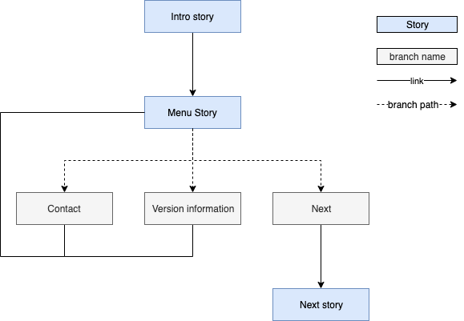

# Advanced topics

## Advanced search

Available in: <Premium plan="Botfront Cloud" />  <Premium plan="Botfront Enterprise" />

You can use the search bar, left of the training button in the top right corner, to search through your stories.

You'll notice that when you first click on it you can use smart searches.

Here is a recap of the special search strings you can use.

| String                    | Description                                                                |
| ------------------------- | ---------------------------------------------------------------------------|
| `with:triggers`           | This will show stories with trigger rules.                                 |
| `with:highlights`         | This will show stories that contain responses that use onscreen guidance.  |
| `with:custom_style`       | This will show stories that contain responses with custom styles.          |
| `with:observe_events`     | This will show stories that contain responses that observe user events.    |
| `status:unpublished`      | This will show unpublished stories.                                        |
| `status:published`        | This will show published stories.                                          |

You can combine several of those smart searches to refine your search criterias.

For instance, the query `with:triggers with:highlights welcome` will yield stories that have at least one trigger rule, one response with onscreen guidance and that contain the word `welcome`.

## Explicit domain declaration

An important part of developing and maintaining a Rasa virtual assistant is keeping [domain files](https://rasa.com/docs/rasa/core/domains/) up to date. Thankfully, Botfront makes this easier by automatically parsing the contents of your stories and extracting the different actions, entities, slots, etc. referenced within.

However, it’s not always possible to infer everything that needs to go into the domain. For example, you might need to invoke a custom action, which in turn invokes another action, or makes use of a slot.

## Linking a story to itself

Linking a story to itself is only available on a story that has branches. For example, this can be used to create a menu dialogue, with a "go back" option looping back to the start of the story.
However, when using this feature, the story that is linking to itself also needs to be a destination story of another story, that will serve as an introduction story to the loop. **Otherwise, the self linking story would not be reachable.**

Schema of a self linking story (Menu story) with an intro story:

A sample self-linked story:

